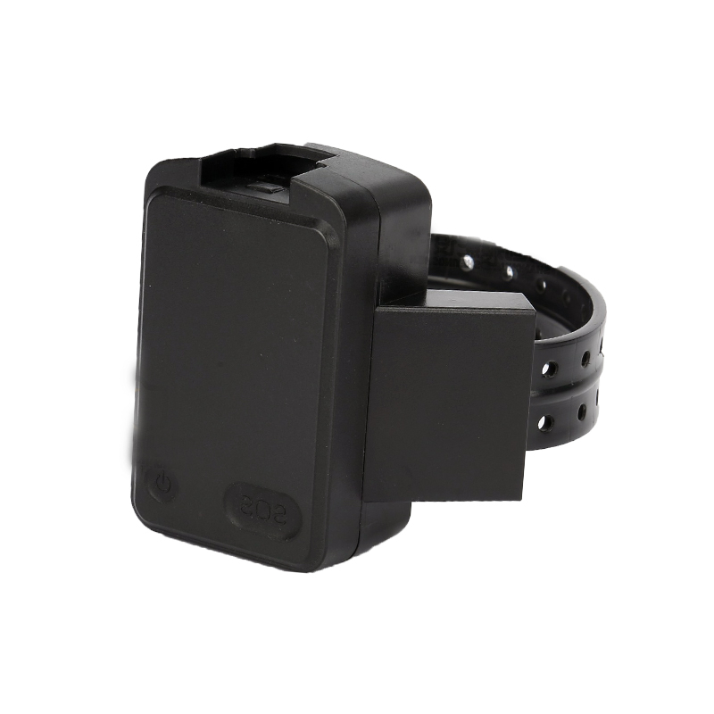

# Megastek - MT65

MT65 Ankle Tracker

The MT65 is a purpose-built ankle GPS tracker designed for continuous offender and parolee supervision and is Plaspy compatible for straightforward platform integration. Combining a high-precision Ublox GNSS chipset with multi-network cellular communications and Wi‑Fi positioning, the MT65 delivers reliable real-time tracking, tamper detection, and emergency alerts in a waterproof, wearable form factor.

The MT65 is optimized for cases that demand persistent telemetry and secure monitoring: parolee supervision, electronic monitoring of offenders, and home isolation of psychiatric patients. With SMS, GPRS \(TCP/UDP\) and hybrid positioning \(GPS+LBS+AGPS+WIFI\), the device feeds location, status and alarm data to Plaspy for live oversight, historical playback and case management workflows.

## Key Highlights

- Plaspy compatible GPS tracker: seamless integration via SMS and GPRS for real-time tracking and historical playback.
- Hybrid positioning \(GPS + LBS + AGPS + Wi‑Fi\) for improved indoor and outdoor accuracy.
- Robust anti-tamper and safety features: belt on/off alarm, SOS button, geo-fence alerts and low battery warnings.
- Durable, comfortable wearable design with optical fiber + silicone strap and IP68 waterproof protection for continuous use.
- Multi-network cellular communications using SIMCOM7600 \(2G/3G/4G\) for broad coverage and reliable telemetry uplink.
- Long-life polymer battery \(1900–2000 mAh\) capable of typical operation over 24 hours with 2-minute reporting intervals.
- Compatible with major third‑party tracking platforms \(e.g., Traccar, Gurtam, Navixy\) for flexible deployment and case management.

## How It Works with Plaspy

When paired with Plaspy, the MT65 delivers continuous situational awareness and event-driven notifications to supervisors and case managers. The device transmits positional fixes, alarm states and device telemetry over SMS or GPRS \(TCP/UDP\) so Plaspy can display live location, trigger alerts, and log historical routes for auditing and compliance.

- Real-time location and telemetry updates delivered to Plaspy via GPRS \(TCP/UDP\) or SMS.
- SOS emergency alarm and remote voice monitoring routed to Plaspy for immediate response workflows.
- Geo-fence alerts and belt on/off \(tamper\) alarms generate instant notifications inside Plaspy dashboards.
- Low battery and device status telemetry shown in Plaspy for proactive maintenance scheduling.
- Historical track playback and configurable reporting intervals for auditing supervised release and case reviews.

## Technical Overview

| Connectivity | SIMCOM7600 cellular module supporting 2G/3G/4G networks; SMS, GPRS \(TCP/UDP\) |
| --- | --- |
| Bands | 2G GSM 900/1800; 3G WCDMA B1/B2/B5/B8; 4G LTE-FDD B1/B2/B3/B4/B5/B7/B8/B12/B13/B18/B19/B20/B26/B28 |
| Power & Battery | Polymer lithium-ion 1900 mAh \(expandable to 2000 mAh\), 4.2V; typical operation >24 hours at 2‑minute reporting |
| Interfaces | Two buttons \(SOS and power\); LED indicators for power, GPS and GSM; belt on/off tamper detection; remote voice monitoring |
| GNSS | Ublox GPS chipset; GPS sensitivity -160 dB; hybrid positioning supported \(GPS+LBS+AGPS+WIFI\) |
| Bluetooth | Not specified in product description |
| Wi‑Fi | Wi‑Fi positioning supported; module frequency 2.4–2.5 GHz \(2400–2483.5 MHz\); optional Wi‑Fi base station support for home environments |
| Remote Management | GPRS data logger; automatic APN query; configurable time zones and power-saving tracking profiles; compatible with major third-party servers \(e.g., Traccar, Gurtam, Navixy\) |
| Form Factor | Wearable ankle unit integrated into optical fiber + silicone strap; dimensions 70 × 42 × 25 mm; weight 121 g; IP68 |

## Use Cases

- Continuous offender monitoring and electronic ankle supervision for parole and house arrest programs.
- Parolee and conditional release oversight with real-time alerts and geo-fence enforcement.
- Home isolation monitoring for psychiatric patients where tamper-resistant wearable tracking and emergency SOS are required.
- Case management scenarios requiring reliable telemetry, historical track playback and integration into Plaspy dashboards.

## Why Choose This Tracker with Plaspy

The MT65 is built specifically for supervised-wear use: it balances accuracy, durability and user comfort while delivering the telemetry and alarm signals Plaspy needs to manage cases effectively. Its Ublox GNSS and hybrid positioning blend with Wi‑Fi and cellular fallback to maintain location continuity indoors and outdoors. Anti-tamper design, SOS and low battery alerts help reduce false negatives and speed incident response.

Administrative teams benefit from straightforward Plaspy compatibility: SMS/GPRS reporting, automatic APN handling and support for third-party servers make onboarding faster and reduce integration overhead. While the MT65 is not a vehicle tracker and does not provide ignition, immobilizer or fuel monitoring, its telemetry and platform interoperability let organizations centralize supervised-wear monitoring alongside other asset tracking systems when needed.

For agencies and service providers that require a Plaspy compatible GPS tracker with proven wearable durability, reliable telemetry and comprehensive alarm features, the MT65 offers a focused, deployable solution for offender supervision and similar continuous monitoring programs.

