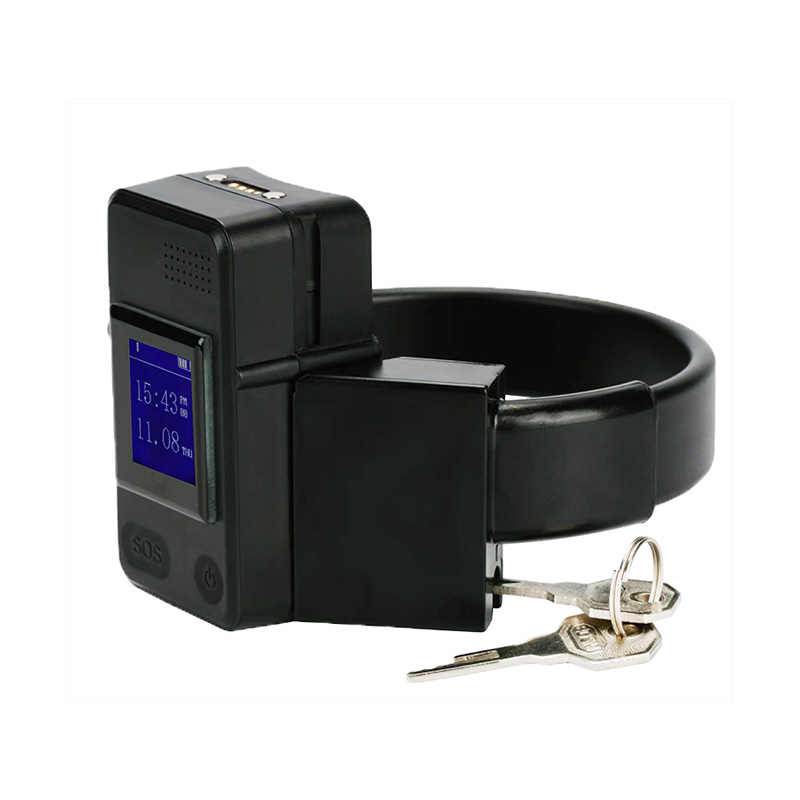

# Megastek - MT65PLUS

The MT65PLUS is a professional-grade GPS tracker in an ankle‑bracelet form factor, designed for continuous personal monitoring and tamper‑resistant deployments. Plaspy compatible out of the box, the MT65PLUS combines robust anti‑tamper hardware, multi‑mode positioning and built‑in physiological telemetry to deliver reliable real‑time tracking for parole programs, correctional facilities, care management and supervised release.

Smaller than a cellphone but engineered for durability, MT65PLUS provides accessible real‑time tracking and status reporting via Plaspy and other platform integrations. The bracelet’s reinforced aluminium and optical‑fiber strap, physical lock and electronic remote lock/unlock option deter removal, while integrated features such as two‑way voice, SOS alerting and a heart‑rate sensor extend monitoring beyond location to vital telemetry and incident response.

## Key Highlights

- Plaspy compatible for seamless real‑time tracking and event reporting on web and mobile platforms.
- Comprehensive anti‑tamper protection: reinforced strap, physical lock, belt cut and on/off alarms, and siren alerts.
- Built‑in heart‑rate sensor for continuous physiological telemetry useful in care and special‑needs monitoring.
- Multi‑mode positioning \(GPS + LBS + AGPS + Wi‑Fi\) for improved outdoor and indoor/home accuracy.
- Two‑way voice and voice monitoring allow authorized staff to call and communicate with the wearer.
- Remote electronic lock/unlock \(immobilizer‑style control\) and SOS emergency alert for supervised interventions.
- Rugged, certified hardware: CE, IP68 waterproof rating, REACH compliance and vibration/IK08 test reports.
- Optional mobile battery cradle extends operating time ~3–4 days and supports wireless charging for convenient maintenance.

## How It Works with Plaspy

When paired with Plaspy, the MT65PLUS streams location and telemetry to the platform using standard cellular connectivity and agreed‑upon data formats. Plaspy displays real‑time tracking on map views, logs tamper and SOS events, and delivers configurable alerts to supervisors. Integration uses the device’s reported GNSS coordinates, Wi‑Fi‑assisted fixes, and status channels so monitoring teams can react quickly to incidents.

- Real‑time location and telemetry updates delivered to Plaspy for live monitoring and historic playback.
- Tamper events \(belt cut, removal attempts, device power off\) and low battery warnings trigger immediate alerts.
- Physiological telemetry — continuous heart‑rate readings — available as telemetry streams for care dashboards.
- SOS emergency alert and two‑way voice enable rapid response and direct communication through Plaspy event workflows.
- Remote lock/unlock \(immobilizer‑style\) control can be authorized from Plaspy or integrated back‑end systems for supervised interventions.
- Wi‑Fi base‑station support improves indoor/home location accuracy and complements GPS/LBS positioning.

## Technical Overview

| Connectivity | Cellular \(SIM7600 module variants\), Wi‑Fi 802.11 b/g/n; GSM/GPRS/EDGE and 3G/4G LTE depending on region. |
| --- | --- |
| Bands | SIM7600E \(EMEA / Korea / Thailand\): LTE‑TDD B38/B40/B41; LTE‑FDD B1/B3/B5/B7/B8/B20; UMTS/HSPA+ B1/B5/B8; GSM B3/B8. \           SIM7600A \(North America\): LTE‑FDD B2/B4/B12; UMTS/HSPA+ B2/B5. \           SIM7600SA \(Australia/NZ/South America\): LTE‑TDD B40; LTE‑FDD B1/B2/B3/B4/B5/B7/B8/B28; UMTS/HSPA+ B1/B2/B5/B8; GSM 850/900/1800/1900 MHz. |
| Power & Battery | 3000 mAh polymer Li‑ion battery \(3.8 V\). Optional mobile battery cradle extends operating time by ~3–4 days. Supports wireless charging. |
| Interfaces | Physical lock with reinforced strap; electronic remote lock/unlock authorization; SOS button; siren alarm; two‑way voice and voice monitoring; tamper and power‑loss alarms. |
| GNSS | U‑blox GPS chipset with GPS/AGPS and LBS support; Wi‑Fi‑assisted positioning for improved indoor accuracy. |
| Bluetooth | Bluetooth sensors are not listed for this model; indoor assistance is provided via Wi‑Fi base station support and built‑in sensors \(heart‑rate\). |
| Remote Management | Compatible with multiple tracking platforms \(TeraTrack, Navixy, iTrack, Gurtam, Traccar, GeoTrucks\) and Plaspy for remote monitoring and data reporting. |
| Form Factor | Ankle‑bracelet; reinforced aluminium + optical‑fiber strap; net weight ~217 g; packaging 22 × 20 × 5 cm, box weight ~620 g. IP68 waterproof, CE & REACH certified; vibration/IK08 tested. |

## Use Cases

- Correctional and parole monitoring — continuous location tracking, tamper alerts and remote lock/unlock for supervised releases.
- Parolee and offender supervision — SOS and two‑way voice for incident verification and rapid response.
- Elderly and special‑care monitoring — real‑time heart‑rate telemetry combined with location and emergency alerts for caregivers.
- Home or indoor monitoring where Wi‑Fi base stations improve positioning accuracy for supervised individuals.
- Professional deployments requiring rugged, certified hardware with Plaspy compatible integration into existing monitoring workflows.

## Why Choose This Tracker with Plaspy

MT65PLUS is built for organizations that require dependable, tamper‑resistant GPS trackers with integrated health telemetry and secure communications. Its combination of reinforced physical security, U‑blox GNSS accuracy, multi‑mode positioning and two‑way voice makes it ideal where situational awareness and immediate response are essential. As a Plaspy compatible device, MT65PLUS feeds real‑time tracking, telemetry and alarm events into Plaspy’s monitoring dashboards and alerting systems—enabling scalable supervision, clear audit trails and faster incident management.

This tracker focuses on personal monitoring telemetry \(heart‑rate, SOS, tamper status\) rather than vehicle telemetry such as fuel monitoring or ignition inputs, while still offering immobilizer‑style remote lock/unlock control for supervised restrictions. If your deployment requires tight anti‑tamper security, continuous physiological monitoring, and seamless Plaspy integration for real‑time tracking and response, MT65PLUS provides a purpose‑built solution.

