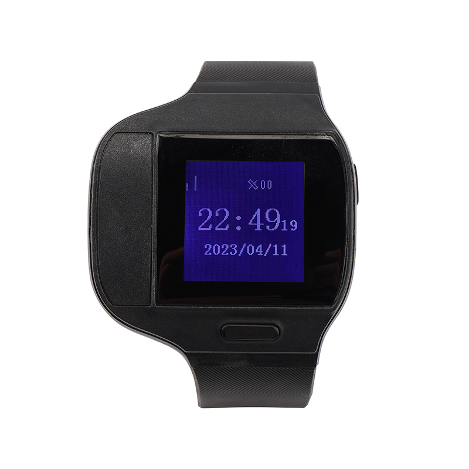

# Megastek - MT80

The Megastek MT80 Series is a health care focused GPS watch designed for continuous location and on‑body medical telemetry. As a 4G smart watch variant family, the MT80 combines real time tracking with health sensors such as skin temperature, SpO2 and heart rate, alongside SOS, two‑way voice and event alarm functions. Its compact, water resistant wearable form factor and wireless charging make it suitable for prolonged use in supervised care and personal protection scenarios.

As a Plaspy compatible device, the MT80 can deliver location, event and health telemetry into the Plaspy platform for live monitoring, alerts and historical review. The series offers two hardware variants and flexible connectivity options, allowing integrators and care teams to route tracking and telemetry data into Plaspy for operational visibility, alarm handling and reporting across monitored individuals and small fleets.

## Key Highlights

- Plaspy compatible GPS health watch that reports location and events for real time monitoring.
- Integrated health telemetry including skin temperature, blood oxygen SpO2 and heart rate for patient and elderly care.
- SOS alarm and two way voice for immediate communication and incident response.
- Two hardware variants offering Bluetooth forwarding or Wi Fi assisted positioning to suit different connectivity needs.
- Proven GNSS module for consistent satellite positioning and reliable track history.
- Wearable design with water resistance and wireless charging for comfortable daily use.
- Support for standard telemetry reporting and protocol customization to ease integration.

## How It Works with Plaspy

The MT80 Series integrates with Plaspy by sending location, event and health telemetry to Plaspy ingestion endpoints using the device's standard reporting methods. Once configured, data from the watch appears in Plaspy for monitoring, alerts and historical analysis, enabling caregivers and operators to maintain situational awareness from a central dashboard.

- Real time location and event updates delivered to Plaspy for live tracking and map visualization.
- Health telemetry forwarding so temperature, SpO2 and heart rate data can be surfaced in platform dashboards and reports.
- SOS and alarm events reported to Plaspy to trigger notifications and response workflows.
- Variant specific forwarding where the MT80BLE can relay sensor data through a paired phone gateway and the MT804G uses wireless assisted upload to improve fix reliability.
- Protocol mapping and customization allow integrators to align MT80 fields with Plaspy telemetry and alarm schemas for consistent reporting.

## Typical Use Cases

- Outdoor elderly care and patient monitoring where continuous location and vital sign awareness are required.
- Personal protection and supervised individuals needing SOS, voice contact and geo fence alerts.
- Lone worker safety programs that require wearable tracking and alarm escalation.
- Small scale deployments where wearable biometric data combined with location improves incident response.

## Why Choose This Tracker with Plaspy

The MT80 Series is a practical choice for organizations that need more than basic location tracking. Its combination of wearable comfort, health telemetry and alarm features complements Plaspy's monitoring, alerting and reporting capabilities, making it useful for care providers, security teams and supervisors who require both positional awareness and vital sign insight.

If you want more context on how MT80 devices can be brought into your Plaspy deployment or to evaluate suitability for a particular operational scenario, learn more about Plaspy on the main website https://www.plaspy.com. Product specifications, availability and manufacturer details can change over time, so please verify current technical documentation and model variants at the official Megastek site https://www.megastek.com/.
