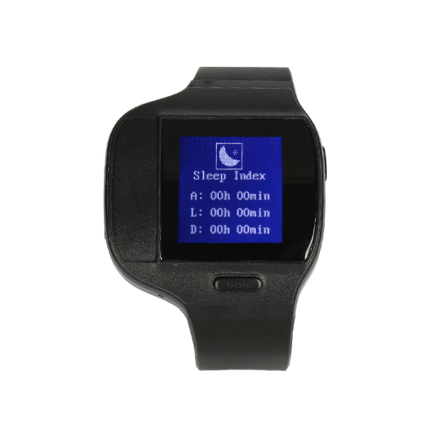

# Megastek - MT80Q

The MT80Q Personal Tracking Watch is a compact wearable designed for personal security, elderly care and remote telemetry. It combines a 1.28 inch e-ink display with a Ublox GPS module to provide regular location reporting over GSM GPRS networks. Built with a focused set of safety features — fall detection, SOS emergency alarm, two way voice and an anti disassembly alarm — the MT80Q is intended for real time tracking and quick response in situations where individual safety and location visibility matter.

As a Plaspy compatible device, the MT80Q can forward positions, events and simple telemetry to Plaspy for map display, alerts and reporting. Its GPRS data logging and automatic APN query streamline integration so the device can start reporting historical tracks and live updates with minimal platform configuration. For organizations that need wearable location visibility and event driven alerts inside Plaspy, the MT80Q provides a purpose built option for personnel monitoring and emergency notification.

## Key Highlights

- Compact personal tracking watch with a 1.28 inch e-ink display for clear on wrist information.
- Built in safety features including fall detection, SOS alarm and two way voice for emergency response.
- Anti disassembly belt on off alarm to reduce tampering and unauthorized removal.
- Rugged wearable design with waterproof rating IP66 IP67 and wireless charging for convenient daily use.
- Ublox GPS positioning with historical track logging for playback and route review.
- GPRS data logger with automatic APN query to simplify connection to Plaspy and other platforms.
- Power saving modes and low battery alerts to help extend runtime between charges.

## How It Works with Plaspy

When used with Plaspy, the MT80Q transmits location and event messages over GPRS so Plaspy can ingest positions, historical tracks and safety alarms for live monitoring and reporting. The device reports key events that Plaspy can surface as notifications, and its logging behavior allows retrieval of past movements for analysis or audit.

- Real time location updates and telemetry delivered to Plaspy for live situational awareness.
- Fall detection and SOS events forwarded as alerts to Plaspy dashboards and notification channels.
- Anti disassembly alarm messages sent to Plaspy to highlight potential tampering or strap removal.
- Low battery and power saving status reported to Plaspy to support proactive device management.
- Historical track logging available through Plaspy for route playback and export.
- Automatic APN query reduces initial setup steps when integrating the device with Plaspy.

## Typical Use Cases

- Elderly care and assisted living monitoring where fall detection and SOS enable rapid support.
- Lone worker safety for field staff who need location visibility and a fast emergency channel.
- Child and family monitoring with lightweight wearable form factor and boundary awareness.
- Portable asset protection and anti theft scenarios using strap removal alerts and live location.
- Complementary personnel telemetry in mixed fleets alongside vehicle trackers for comprehensive oversight.

## Why Choose This Tracker with Plaspy

The MT80Q is focused on people first telemetry and emergency response. Its wearable design, safety alarms and reliable GPS positioning make it a practical option for organizations that require straightforward, low friction monitoring of individuals. Because it logs historical tracks and simplifies network configuration with automatic APN queries, the MT80Q can be integrated into Plaspy without extensive customization.

This device is optimized for personal security and telemetry rather than vehicle specific inputs or advanced sensor ecosystems. For teams that need a dedicated wearable to deliver fall detection, SOS alerts, anti disassembly protection and everyday durability, pairing the MT80Q with Plaspy provides clear visibility, alerting and reporting suited to those operational needs.

To learn more about how Plaspy supports wearable trackers and personnel monitoring, visit the Plaspy main website https://www.plaspy.com. Product specifications and availability can change over time, so please verify current technical details and manufacturer information on the Megastek site https://www.megastek.com/.
