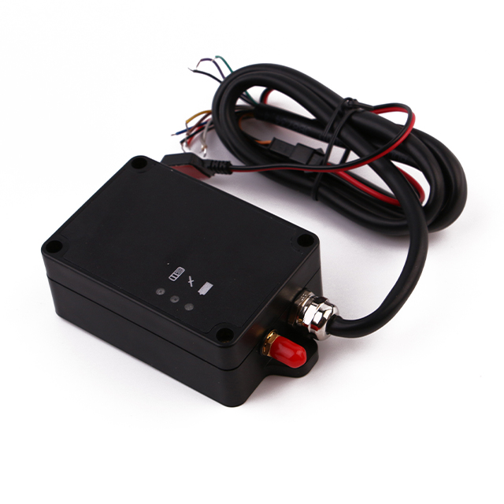

# Megastek - S921

The Megastek S921 is a compact fixed home base station designed to extend supervised monitoring systems for residential and facility environments. It pairs with Megastek ankle trackers and provides local presence detection, multiple alarm signals, and a permanent indoor installation option to support continuous, auditable supervision.

As a Plaspy compatible base station, the S921 reports automated "at home" presence to the Plaspy platform when a paired ankle tracker is within its detection range. Combined with its alarm reporting and backup operation, the S921 improves the reliability of presence and event reporting inside a monitored residence or facility when used with Plaspy.

## Key Highlights

- Dedicated home base station that reports automated "at home" presence for paired ankle trackers.
- Typical indoor detection range of approximately 15–20 meters to indicate residence presence.
- Multi mode cellular connectivity plus a Wi Fi link for reliable server communication and local detection.
- Comprehensive alarm suite including power off, SOS, tamper/remove, hit/impact, and periodic heartbeat reporting.
- Internal backup battery to maintain operation during mains interruption and reduce false offline events.
- Compact fixed form factor for discreet permanent installation in residences or monitored facilities.
- Designed to integrate with monitoring platforms for centralized real time tracking, telemetry, and reporting.

## How It Works with Plaspy

The S921 functions as a local presence gateway between a paired ankle tracker and Plaspy. When the ankle tracker is detected within the station's indoor range, the base station reports an "at home" status to Plaspy; when the tracker leaves range, the platform receives location and telemetry from the ankle unit itself, enabling continuous oversight.

- Real time status updates to Plaspy distinguishing home zone presence versus outdoor tracker position.
- Alarm forwarding for power off, SOS, tamper/remove and hit/impact events so monitoring teams can be alerted.
- Periodic heartbeat reports to help Plaspy maintain device health and connectivity visibility.
- Integration with platform level features such as dashboards, event reporting, and rule based alerts for supervised programs.
- Complementary detection and telemetry support where local Wi Fi detection is combined with tracker sourced location and sensor data.

## Typical Use Cases

- Parole and home confinement programs that require automated home zone verification and alarm reporting.
- Assisted living and care facilities where presence checks and fall or impact alerts improve caregiver response.
- Residential detention or house arrest deployments to reduce false outdoor reports and support enforcement rules.
- Facility anchor deployments to complement outdoor GPS tracking and improve indoor versus outdoor status accuracy.
- Supervised monitoring programs that need centralized real time reporting and auditable event trails.

## Why Choose This Tracker with Plaspy

The S921 base station adds practical value to Plaspy deployments by strengthening home zone accuracy and delivering multiple alarm channels that feed directly into platform workflows. Its permanent installation and battery backup help keep status reporting consistent, reducing false offline conditions and improving the integrity of supervised monitoring records.

When used with Plaspy, the S921 helps operators consolidate presence detection, alarm events, and device health into a single monitoring view. That combination supports faster response, clearer audit trails, and more reliable compliance reporting for residential and facility based supervision programs.

To learn more about Plaspy and platform features visit https://www.plaspy.com. Product specifications, availability, and manufacturer details can change over time; please verify current technical and support information on the Megastek website https://www.megastek.com/.
