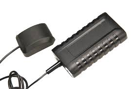

# Megastek - XT-007

The Megastek XT-007 is a vehicle tracker designed to provide reliable location tracking and security features for both fleet and personal vehicles. It offers a sturdy, weather resistant design with water resistance close to IP67 and supports flexible antenna options. The XT-007 includes a range of alarm types, a built in data logger with 8M flash memory, power saving operation, and optional two way communication and SOS capability, making it suitable for continuous on‑vehicle deployment.

As a Plaspy compatible device, the XT-007 can feed position updates, alarms, and logged history into Plaspy for centralized monitoring and reporting. Plaspy can use the device's real time tracking and alert features to present live location, geofence and overspeed notifications, and historical playback from the tracker's data logger, giving operators operational visibility across vehicles and assets.

## Key Highlights

- Water resistant construction near IP67 for reliable outdoor use
- Flexible antenna support with built in or external antenna options
- Multiple alarm types including geo fence, over speed, vibration, remove, low battery, and SOS
- Built in 8M flash memory data logger for historical tracking when signal is unavailable
- Power saving mode for extended deployments and lower power consumption
- Optional two way communication for remote monitoring and emergency calling
- Designed for vehicle and fleet tracking with a balance of durability and feature set

## How It Works with Plaspy

The XT-007 can transmit its location, status updates, and alarms to Plaspy so fleet managers and operators can view assets on a single platform. Plaspy ingests the tracker's messages and translates them into map events, alerts, and historical records that support operational oversight and reporting.

- Real time visibility of vehicle positions and movement on Plaspy maps
- Alarm handling in Plaspy for geo fence, overspeed, vibration, low battery, and SOS events
- Historical playback and route reconstruction using the tracker's data logger and Plaspy reporting
- Fleet dashboards and summaries for operational metrics and event trends
- Remote commands and two way monitoring where the XT-007 configuration includes two way communication
- Device health and status indicators to help prioritize maintenance and replacements

## Typical Use Cases

- Commercial fleet tracking for route oversight and driver monitoring
- Rental vehicle and shared vehicle location and security
- Logistics and delivery coordination with real time tracking and alerts
- Asset protection and recovery with geofence and remove alarms
- Long term vehicle monitoring where power saving and data logging are important

## Why Choose This Tracker with Plaspy

The XT-007 pairs a rugged, weather resistant hardware profile with a broad set of vehicle safety and monitoring features that align well with Plaspy's platform capabilities. Its support for offline data logging and multiple alarm types makes it suitable for operators who need resilient tracking and actionable alerts under varying conditions.

While the device provides a comprehensive baseline of tracking and security functions, organizations should evaluate their specific operational requirements and confirm that the XT-007's optional communication and input/output features meet their needs. When matched with Plaspy, this tracker can deliver centralized visibility, alert management, and historical analysis to support fleet efficiency and asset protection.

Learn more about Plaspy on the main website https://www.plaspy.com. Product specifications, availability, and manufacturer details can change over time, so verify current specifications with the manufacturer at https://www.megastek.com/.
