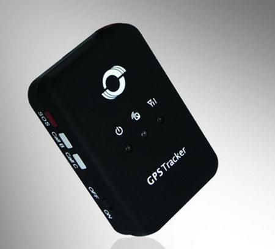

# Meitrack - GT-30

The Meitrack GT-30 is a compact and user friendly personal GPS/GPRS tracker designed to provide reliable position data for monitoring people or pets. Built around integrated GPS positioning and cellular communications, the GT-30 can send location updates to a designated mobile phone or server. It includes features commonly required for personal safety and monitoring such as an SOS panic button, configurable reporting intervals, and internal memory for storing coordinates when a data connection is unavailable.

As a Plaspy compatible device, the GT-30 can forward its location and event data into the Plaspy platform for centralized visibility, alerting, and historical review. That compatibility makes the GT-30 a practical option for organizations or individuals who need a compact tracker with voice features and resilient location reporting, and who want to manage devices and events through Plaspy alongside other fleet and asset tracking endpoints.

## Key Highlights

- Compact personal tracker suitable for monitoring people or pets with discreet form factor
- Two way voice communications and listen in function for direct guardian contact
- SOS panic button and dedicated alarm functions for safety monitoring
- Configurable reporting by time interval or on demand reporting to a server or phone
- Internal memory to store GPS coordinates when there is no GPRS connection
- Geofence control, movement alarm, low battery and speeding alarms for event driven alerts
- Supports SMS and GPRS communication and AGPS assisted positioning for faster fixes

## How It Works with Plaspy

When used with Plaspy, the GT-30 delivers location updates and event messages into the Plaspy platform where they become part of a unified tracking view. Plaspy can ingest reports from the device, display current position on maps, keep historical traces, and generate alerts based on the device events and configured rules.

- Live and periodic location updates from the GT-30 appear in Plaspy for real time monitoring
- SOS and alarm events from the device are surfaced as alerts within Plaspy for rapid response
- Stored coordinates recorded during connectivity gaps can be uploaded and displayed in Plaspy history once a data link is restored
- Geofence events reported by the GT-30 can be used with Plaspy rules and notifications to manage site or area breaches
- Reporting and historical playback in Plaspy enable review of movement patterns and route history
- Device status indicators and alerts available in Plaspy help operators maintain operational oversight

## Typical Use Cases

- Personal safety tracking for children, elderly individuals, or care patients
- Pet tracking for animals that need location monitoring and emergency alerting
- Lone worker or caregiver monitoring where voice contact and panic alerts are required
- Short term or light asset monitoring where compact form factor and offline storage are valuable
- Small scale fleet or vehicle tracking scenarios that need a compact personal device for drivers or riders

## Why Choose This Tracker with Plaspy

The Meitrack GT-30 pairs a small physical footprint with practical safety and reporting features that fit personal and light operational tracking needs. Its two way voice capability and SOS button complement Plaspy monitoring by enabling direct voice contact while Plaspy handles location visibility, alert distribution, and historical records. Internal memory for offline coordinate storage helps maintain continuity of data in areas with intermittent cellular coverage.

For teams and individuals who want a simple, resilient personal tracker that feeds into a modern tracking platform, the GT-30 offers a balanced feature set. Plaspy users benefit from centralized monitoring, rule based alerts, and reporting workflows that make the GT-30 useful for safety, oversight, and basic operational tracking tasks.

Learn more about Plaspy on the main website https://www.plaspy.com. Product specifications and availability can change over time, so please verify current technical details and features on the manufacturer site https://www.meitrack.com/.
