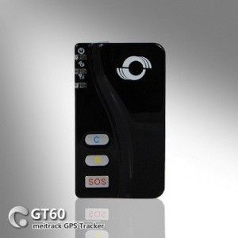

# Meitrack - GT-60

The Meitrack GT-60 is a compact and user-friendly GPS tracker designed specifically for pet tracking. With its built-in GPS module, it can accurately obtain the position data of your pet and use GSM capability to send this data to a mobile phone or server base. This allows you to easily monitor your pet's location using the tracker.

But the GT-60 is not just a pet tracker. It is also a portable GPS tracking device that can be used as an emergency cellular phone. It even allows for speed dialing of three numbers for two-way voice communication. This means that in case of an emergency, you can easily contact the preset numbers and communicate with them directly through the tracker.

With a fully charged battery, the GT-60 can continue working for more than two days, ensuring that you can track your pet or use it as an emergency phone for an extended period of time. Its compact size, high precision, and easy-to-use design make it an excellent choice for a personal tracking device. Whether you want to keep an eye on your furry friend or have a reliable emergency communication device, the Meitrack GT-60 is a reliable and versatile option.

### Outstanding Features:

- Built-in GPS module for accurate position tracking
- GSM capability for sending position data to a mobile phone or server base
- Can be used as an emergency cellular phone
- Allows speed dialing of three numbers for two-way voice communication
- Long battery life, lasting for more than two days on a full charge
- Compact size and easy-to-use design

