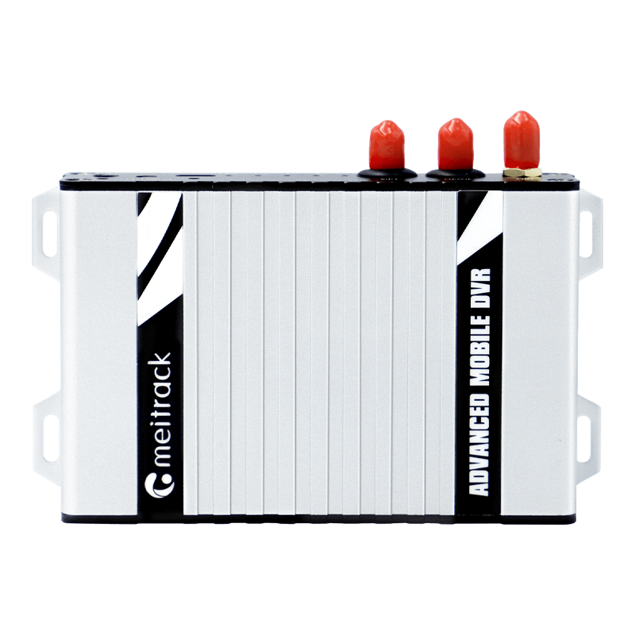

# Meitrack - MD500S

The MD500S is a compact mobile DVR and GPS tracker from Meitrack designed for fleet management and vehicle security projects. It combines integrated GNSS positioning, multi network cellular connectivity, and four channel H.264 video capture with on board AI features such as ADAS, DMS and BSD to deliver synchronized location and video telematics for commercial vehicles.

As a Plaspy compatible device, the MD500S can forward location fixes, telemetry and event data into Plaspy for centralized monitoring and reporting. Its combined tracking and video capabilities make it suitable where operators need both real time visibility and recorded evidence tied to vehicle events within the Plaspy platform.

## Key Highlights

- Plaspy compatible for centralized fleet tracking, telemetry ingestion and linked video evidence.
- Integrated AI video telematics supporting ADAS, DMS and blind spot detection for driver safety analytics.
- Four channel video capture with H.264 compression for efficient recording and streaming workflows.
- Multi network connectivity with cellular and dual band Wi Fi for reliable data uplink options.
- Rich I O and peripheral support for digital inputs, analog inputs, CAN and RS232 to capture vehicle signals.
- Vehicle grade power handling and expandability with microSD storage and remote management tools.

## How It Works with Plaspy

When connected to Plaspy, the MD500S streams positional data and vehicle telemetry alongside event flags and video clips so operators can monitor movement, review incidents and trigger operational rules. Plaspy can correlate GNSS fixes with device events and recorded footage to provide timeline based insights and alerts.

- Real time location and telemetry updates to Plaspy for live fleet dashboards and route monitoring.
- AI event notifications such as ADAS and driver monitoring alerts forwarded to Plaspy as alarm records.
- Fuel and sensor data transmitted to Plaspy for fuel monitoring, trend analysis and theft detection workflows.
- Ignition, door and other digital input events reported to Plaspy and usable in automated rules and alerts.
- Access to live or recorded H.264 video and audio for incident review linked to Plaspy event records.

## Typical Use Cases

- Passenger transport and shuttle fleets requiring synchronized GPS and video for safety and passenger monitoring.
- Logistics and delivery operations needing route visibility, driver behavior insights and fuel management.
- Security and anti theft deployments using relay controls, access logging and event driven immobilization workflows.
- Cold chain and temperature sensitive cargo monitoring combined with location and recorded evidence.
- Incident capture and post event review for accident reconstruction and driver coaching.

## Why Choose This Tracker with Plaspy

Pairing the MD500S with Plaspy brings together on board video analytics and robust telemetry in a single device, helping fleet operators centralize tracking, safety monitoring and evidence management. The MD500S is designed for commercial vehicle environments with broad peripheral support and remote management features that simplify scaled deployments and ongoing administration.

To learn more about how Plaspy can work with Meitrack devices visit https://www.plaspy.com. Product specifications, availability and manufacturer details can change over time, so please verify current technical information and variants on the official Meitrack site https://www.meitrack.com/ before planning deployments.
