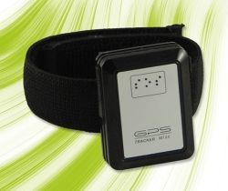

# Meitrack - MT-88

The Meitrack MT-88 is a compact, lightweight GPS tracker designed for a range of personal and small asset tracking needs. At 61x42x15mm and about 50g it is easy to attach to a belt or a pet collar using the included clip. The device combines SiRF III GPS positioning with Quad Band GSM connectivity and AGPS assistance to provide reliable location reporting in common tracking scenarios. Built in features described for the MT-88 include multiple tracking modes, voice monitor capability, internal logging memory, motion detection, an SOS alarm, and a rechargeable internal battery.

As a device compatible with Plaspy, the MT-88 can feed location and event data into the Plaspy platform for centralized visibility and management. Plaspy can present MT-88 position updates, history, and alerts alongside other devices so organizations and individuals can monitor assets, pets, or vehicles from a single dashboard. The MT-88s low power profile and flexible tracking options make it a practical choice for users who need long standby operation and a variety of tracking behaviors that map well to Plaspy reporting and alerting features.

## Key Highlights

- Compact and lightweight design suitable for pets personal belongings and small assets
- SiRF III GPS positioning with AGPS assistance for improved initial fix performance
- Quad Band GSM connectivity for broad regional cellular coverage
- Multiple tracking modes including track on demand time interval and distance interval
- Low power consumption and long standby time for extended deployments
- Built in motion sensor internal logging memory and SOS alarm for security and incident reporting

## How It Works with Plaspy

When used with Plaspy the MT-88 provides positional and event information that Plaspy can display, log, and use to drive alerts and reports. Integration lets you manage MT-88 devices alongside other trackers to maintain consistent operational oversight across a mixed fleet.

- Real time location on Plaspy maps and device lists for immediate visibility
- Historical route and position reports based on device transmissions and internal logs
- Event alerts in Plaspy for SOS triggers and motion events reported by the MT-88
- Scheduled tracking and distance based updates appear as configurable data points in Plaspy reporting
- Track on demand events can be reflected in Plaspy when the device sends an immediate location update
- Device status and recent activity available in Plaspy to support operational decisions

## Typical Use Cases

- Pet tracking and monitoring while retaining a small form factor and lightweight fit
- Personal item protection such as luggage or backpacks during travel
- Asset tracking for portable equipment and high value tools
- Light vehicle tracking for scooters motorcycles or small service vehicles
- Field staff position monitoring for teams operating in dispersed locations

## Why Choose This Tracker with Plaspy

The MT-88 is a practical option when you need a small versatile tracker that balances portability with functional tracking features. Its combination of compact size, assisted GPS, multiple reporting modes, and basic security functions like SOS and motion detection make it a suitable fit for mixed deployments where Plaspy provides consolidated monitoring, alerts, and reporting.

If your deployment requires simple reliable tracking for people pets or small assets and you want to manage those devices within a single platform, pairing the MT-88 with Plaspy can deliver clear operational benefits. For full accuracy on technical details features and current availability please consult the manufacturer documentation and verify how the device will behave in your specific operating environment.

Learn more about Plaspy and how it can work with compatible trackers on the Plaspy website https://www.plaspy.com. Product specifications availability and manufacturer details can change over time so please verify current MT-88 specifications on the official Meitrack website https://www.meitrack.com/
