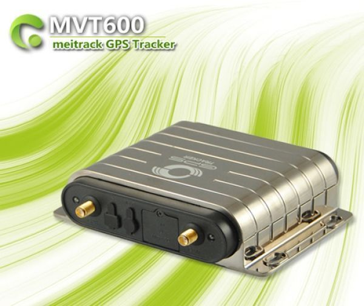

# Meitrack - MVT-600

The Meitrack MVT-600 is a compact GPS vehicle tracker designed to provide continuous location monitoring and a range of extendable features. It supports event driven monitoring and can be fitted with optional accessories such as an internal camera, fuel sensors, and an RFID reader to broaden its capability for security and operational oversight.

As a Plaspy compatible device, the MVT-600 can integrate into Plaspy's fleet management environment to provide live visibility, alerts, and historical logs. When used with Plaspy, the MVT-600's event snapshots, geofence activity, and status reports become actionable information for fleet operators and administrators who need centralized monitoring and reporting.

## Key Highlights

- Optional internal camera for event driven snapshots such as door activity and vehicle start
- Support for accessories like fuel sensors and RFID reader to extend monitoring and control
- Real time location tracking and historical GPS logging for route analysis
- Geofence alerts and speed notifications to help enforce operational rules
- Listen in capability and an S.O.S. button for enhanced safety and emergency response
- Remote engine stop function available for theft response and unauthorized use prevention

## How It Works with Plaspy

The MVT-600 supplies position updates and event notifications that Plaspy ingests to present a unified view of vehicle activity and alerts. Plaspy uses those inputs to deliver mapping, reporting, and operational alerts tailored to your fleet workflows.

- Live location and movement telemetry displayed on Plaspy maps for fleet visibility
- Event driven snapshots from the optional camera available alongside trip and alert records
- Geofence and speed alerts routed through Plaspy for immediate notification and auditing
- Historical logs and trip reports for operational analysis and maintenance planning
- Emergency S.O.S. indicators and remote immobilization events surfaced to operators for quick action

## Typical Use Cases

- Private and company vehicle tracking where interior monitoring and driver identification are needed
- Rental fleet management with driver authorisation using RFID and event audit trails
- Temperature sensitive transport monitoring when paired with fuel or temperature related sensors
- Security sensitive vehicles requiring listen in capability, S.O.S. alerts, and remote stop options
- Route and usage reporting for maintenance scheduling and operational optimization

## Why Choose This Tracker with Plaspy

The MVT-600 combines flexible accessory support with a set of core tracking and safety features that suit a variety of fleet operations. Its optional camera and RFID support allow organisations to add layers of access control and visual verification without replacing the core tracking hardware. When integrated into Plaspy, those capabilities become part of a managed workflow for monitoring, alerting, and reporting.

Choosing the MVT-600 for use with Plaspy can make sense for teams that need a balanced mix of location visibility, event driven evidence, and access control options. The device's feature set aligns with common fleet needs while Plaspy provides the platform for consolidated oversight and record keeping.

To learn more about how the MVT-600 can work with Plaspy, visit https://www.plaspy.com. Product specifications and availability can change over time, so please verify current details with the manufacturer at https://www.meitrack.com/ before making procurement or deployment decisions.
