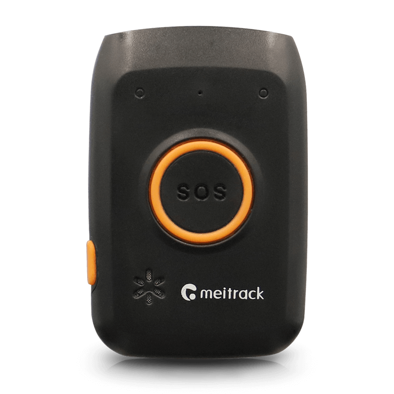

# Meitrack - P88L

The Meitrack P88L is a compact portable GNSS tracker designed primarily for personal safety and family tracking. It combines multi technology positioning with a simple two button layout and a dedicated SOS control to provide reliable real time location and timely alerts. The device is mobile and rugged, offers long standby in smart working mode, supports fast magnetic charging, and includes offline buffering for continuity during temporary coverage gaps.

As a Plaspy compatible device, the P88L can stream location and basic telemetry into the Plaspy platform so caregivers, security teams and family members can monitor movement, receive SOS notifications, and review location history. Its multi mode positioning and alert features make it a practical option for people centric monitoring tasks that need straightforward operation and continuous visibility through Plaspy.

## Key Highlights

- Designed for personal safety with a dedicated SOS button and a clear two button interface for easy use.
- Multi mode positioning supporting GNSS plus supplemental network based fixes and optional Wi Fi and Bluetooth assistance to improve continuity.
- Portable and rugged form factor with long standby in smart working mode and fast magnetic charging for quick turnaround.
- Offline buffer memory to store data during coverage gaps and OTA update capability for remote maintenance.
- IP67 rated durability and a wide operating temperature range suitable for daily carry and outdoor use.
- Compact size and accessories such as a protective pouch for discreet wearable or portable deployment.

## How It Works with Plaspy

When paired with Plaspy the P88L provides live location updates and event alerts so authorized users can monitor status and respond to incidents. Plaspy receives position reports and alert signals and presents them in dashboards and reporting tools for operational oversight, incident review, and historical playback.

- Real time location streaming and position history available in Plaspy dashboards for tracking and review.
- SOS and man down alerts forwarded to Plaspy with timestamped locations for rapid response and incident logging.
- Supplemental positioning inputs such as network based fixes and optional Wi Fi or Bluetooth assistance improve tracking continuity shown in Plaspy.
- Offline buffered data transmitted to Plaspy when connectivity resumes to preserve continuous history.
- Basic activity telemetry such as step counting and simple status indicators can provide contextual information for wellness monitoring and reporting.

## Typical Use Cases

- Personal safety monitoring for seniors with fall detection, SOS alerts and caregiver location sharing.
- Child tracking and family monitoring with geo awareness and anti lost assistance.
- Lone worker oversight where remote teams need location and emergency alerts for staff safety.
- Event staff or temporary personnel tracking where compact devices and long endurance are required.
- Proximity or asset pairing scenarios using Bluetooth to link people to small items and trigger separation alerts.

## Why Choose This Tracker with Plaspy

The P88L is a focused solution for people centric tracking where simplicity, durability and continuous visibility are priorities. Its multi mode positioning, long endurance, and straightforward alert controls make it suitable for non technical users while providing the data continuity and remote maintenance features that administrators expect when using Plaspy for monitoring and reporting.

To learn more about Plaspy and how compatible trackers integrate with the platform visit https://www.plaspy.com. Product specifications and availability can change over time, so please verify current technical details and regional variants on the manufacturer site https://www.meitrack.com/.
