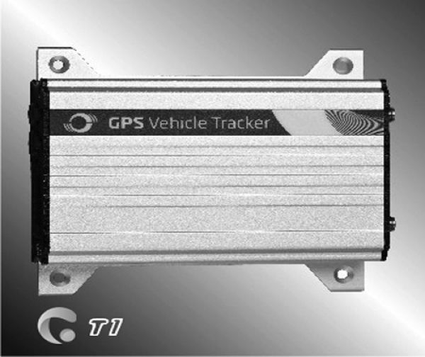

# Meitrack - T1

The Meitrack T1 is a compact GPS vehicle tracker designed for both fleet and personal vehicle tracking. It combines continuous location reporting with GPS logging to provide real time position visibility and historical route playback. The device also includes two way audio, an S.O.S. button, speed alerting, and compatibility with accessories such as a handset phone and an RFID reader, making it a flexible option for a range of tracking needs.

As a Plaspy compatible device, the T1 can feed its location and event data into Plaspy to support centralized monitoring and reporting. Plaspy can use the T1 data to present live positions, show past journeys, and surface alerts so fleet managers and vehicle owners can maintain operational awareness without managing multiple systems.

## Key Highlights

- Real time location reporting for active vehicle monitoring
- GPS logging for historical route reconstruction and review
- Two way audio capability to communicate with vehicle occupants
- Dedicated S.O.S. button for emergency notification events
- Speed alert feature to notify when a vehicle exceeds set limits
- Support for accessories such as a handset phone and RFID reader

## How It Works with Plaspy

When connected to Plaspy the Meitrack T1 supplies location and event data that Plaspy organizes into maps timelines and alerts for operational use. Plaspy ingests the T1 feed to provide unified visibility across vehicles and to help teams act on incidents and exceptions.

- Live position tracking displayed on Plaspy maps for real time oversight
- Playback of GPS logged routes for post trip analysis and reporting
- Alerts and notifications for S.O.S. events and speed threshold breaches
- Two way audio status and accessory events presented as actionable entries
- Centralized reporting and exportable logs for fleet auditing and review

## Typical Use Cases

- Fleet monitoring for delivery vans service vehicles and mobile teams
- Personal vehicle tracking for owner peace of mind and recovery support
- Emergency response workflows using the S.O.S. button for rapid attention
- Driver communication via two way audio for coordination and instruction
- Access control scenarios where RFID reader events help confirm authorized use

## Why Choose This Tracker with Plaspy

The Meitrack T1 pairs a practical set of tracking and communication features with broad accessory support, making it a versatile choice for organizations that need both location visibility and driver interaction. Its combination of real time tracking and logged history fits common Plaspy workflows around monitoring performance, investigating incidents, and keeping teams informed.

If you want consolidated vehicle oversight in Plaspy the T1 is a sensible option to consider. Learn more about Plaspy and how it can integrate device data on the Plaspy main website https://www.plaspy.com. Product specifications availability and accessory compatibility can change over time so confirm current details on the manufacturer site https://www.meitrack.com/
