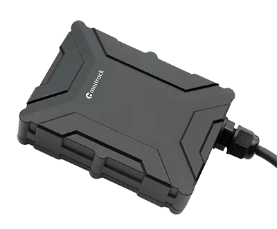

# Meitrack - T399L

The Meitrack T399L is a compact GPS tracker that combines location tracking with Bluetooth communication to support environmental sensors and multiple beacons. Its feature set includes Bluetooth 4.2 and Bluetooth 5.0 compatibility for temperature and humidity sensor monitoring, configurable I/O ports for connecting external devices, driving behavior analysis capabilities, and an IP67 rated casing for protection in wet and dusty environments. The device is sized for discreet installation and is designed for vehicle and asset tracking scenarios where environmental sensing and driver monitoring are valuable.

As a device compatible with Plaspy, the T399L can feed location, sensor, and event data into the Plaspy platform to provide centralized visibility and reporting. Plaspy users can include the T399L in fleets, asset groups, or monitoring profiles to combine its Bluetooth enabled sensor inputs and driving behavior events with Plaspy dashboards, alerts, and historical reports. This compatibility makes the T399L a practical choice for organizations that want both environmental monitoring and operational oversight in one tracker.

## Key Highlights

- Bluetooth 4.2 and 5.0 support for temperature and humidity sensors and multiple beacons
- Configurable I/O ports for connecting external inputs such as fuel or panic buttons
- Driving behavior analysis for monitoring idling, fatigue indicators, harsh events, and collisions
- IP67 water resistant casing for reliable outdoor and industrial use
- Compact size and lightweight design for discreet placement
- Wide vehicle power supply compatibility for flexible deployment across fleets

## How It Works with Plaspy

When paired with Plaspy, the Meitrack T399L provides location plus sensor and event data to the Plaspy platform so teams can monitor assets and drivers from a single interface. Plaspy captures the tracker data to support live visibility, alerts, and post trip analysis.

- Live location tracking and status updates visible on Plaspy maps
- Environmental sensor monitoring such as temperature and humidity reported alongside location
- Driving behavior events forwarded to Plaspy for alerts and driver safety monitoring
- Configurable alerts and notifications based on sensor values, behavior events, or location changes
- Historical reports and analytics in Plaspy to review trips, sensor trends, and driver performance
- Grouping and organizational tools in Plaspy to manage vehicles, assets, and beacon tagged items

## Typical Use Cases

- Fleet vehicle monitoring with driver behavior oversight for safety programs
- Temperature sensitive cargo monitoring using Bluetooth temperature sensors
- Asset tracking using beacons and Bluetooth enabled tags in yards or depots
- Outdoor and industrial vehicle tracking where durability and water resistance matter
- Lone worker or personnel monitoring using panic button inputs and sensor alerts

## Why Choose This Tracker with Plaspy

The T399L is well suited to organizations that need a combination of location tracking, environmental sensing, and driver behavior monitoring. Its Bluetooth support for multiple sensors and beacons adds flexibility for cargo condition monitoring and short range asset detection, while configurable I/O ports give scope for custom inputs that align with operational processes. The IP67 rating and compact form factor make it a reasonable option for outdoor and industrial deployments.

Paired with Plaspy, the T399L delivers a practical data source for fleet managers and operations teams who need consolidated dashboards, configurable alerts, and reporting. Together they provide a way to combine environmental readings, driver events, and location history into operational workflows without requiring specialized hardware changes.

To learn more about managing devices like the Meitrack T399L and how they integrate with Plaspy, visit https://www.plaspy.com. Product specifications and availability can change over time, so please verify current technical details and compatibility on the manufacturer site https://www.meitrack.com/.
