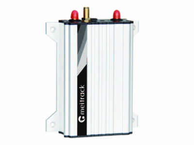

# Meitrack - T622L-F9

The Meitrack T622L-F9 4G Iridium GPS Tracker is a high-end vehicle tracking device that offers precise positioning and reliable tracking capabilities. With its market-proven quality, this tracker is designed to meet the needs of fleet managers and individuals who require accurate and real-time tracking of their vehicles. 

One of the standout features of the T622L-F9 is its Iridium communication mode. This option allows the tracker to work in areas with poor GSM signals, ensuring that you can track your vehicle even in remote or challenging locations. This makes it an ideal choice for businesses or individuals operating in areas with limited cellular coverage. 

In addition to its Iridium capability, the T622L-F9 offers a range of other useful features. It supports Mobileye Fleet Safety, which provides advanced driver assistance and collision avoidance features to enhance the safety of your fleet. It also has a harsh acceleration and braking alert, allowing you to monitor and address aggressive driving behavior. 

The T622L-F9 is a multi-functional tracker that can be compatible with various peripherals, giving you the flexibility to customize its functionality to suit your specific needs. Its compact dimensions \(105 mm x 65 mm x 26 mm\) and lightweight design \(190g\) make it easy to install and conceal in your vehicle. With a wide operating temperature range \(-20C to 55C\) and high operating humidity tolerance \(5% to 95%\), this tracker is built to withstand harsh environmental conditions. 

With its reliable performance, precise positioning, and versatile features, the Meitrack T622L-F9 4G Iridium GPS Tracker is an excellent choice for anyone looking for a high-quality vehicle tracking solution. Whether you need to track a single vehicle or manage a fleet, this tracker offers the functionality and reliability you need to stay connected and in control.

### Key Features:

- Iridium communication mode for tracking in areas with poor GSM signals
- Supports Mobileye Fleet Safety for advanced driver assistance and collision avoidance
- Harsh acceleration and braking alert to monitor aggressive driving behavior
- Compact dimensions and lightweight design for easy installation
- Wide operating temperature range and high operating humidity tolerance for durability
- Compatible with various peripherals for customization

