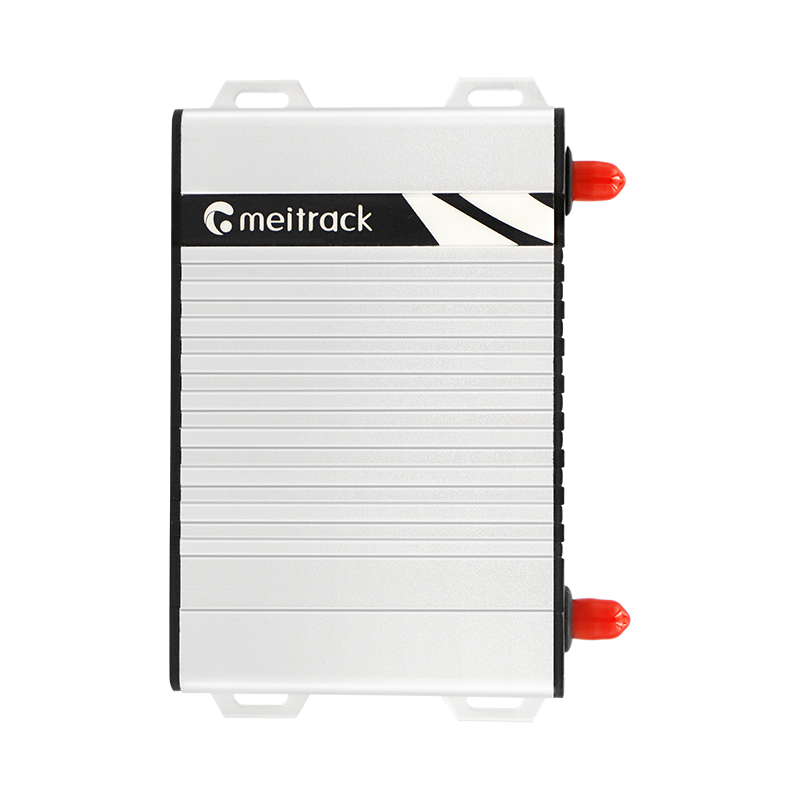

# Meitrack - T633L

The Meitrack T633L is a professional in-vehicle GPS tracker designed for high precision fleet tracking and vehicle telematics. It combines dual frequency GNSS reception with optional dead reckoning to improve positioning in challenging environments such as urban canyons, tunnels, and parking structures. The device is built for robust deployments with multi-generation cellular connectivity, CAN bus telemetry access, Bluetooth sensor support and a range of peripheral interfaces for vehicle data and security applications.

As a Plaspy compatible device, the T633L can be integrated into Plaspy fleet management workflows to provide real time location, telemetry and event data. Its combination of precise positioning and broad vehicle interface options makes it a practical choice for organizations that need accurate tracking, fuel monitoring, remote relay control and richer vehicle context within Plaspy dashboards and reports.

## Key Highlights

- Dual frequency GNSS L1 and L5 reception with optional Dead Reckoning for improved position reliability in difficult signal conditions.
- Multi generation cellular connectivity for broad regional deployment and continuous data reporting.
- Native CAN bus telemetry support to surface vehicle parameters into fleet reports and diagnostics.
- Wide peripheral compatibility including Bluetooth sensors, RFID and driver ID options, relays and audio interfaces for expanded workflows.
- Built for vehicle environments with wide input voltage tolerance and a backup battery to maintain operation during power interruptions.
- Compact, rugged form factor suitable for trucks, buses and specialty vehicles where discreet, professional installation is required.

## How It Works with Plaspy

When connected to Plaspy, the T633L supplies position updates and vehicle telemetry so fleet managers can monitor assets, replay routes and receive timely alerts. Plaspy ingests GNSS fixes, CAN fields and peripheral events to present location and operational data in maps, dashboards and reports that support day to day fleet oversight.

- Real time location and route replay to support dispatch, tracking and historical analysis.
- CAN bus telemetry integration for vehicle speed, engine parameters and other bus derived signals in Plaspy reports.
- Fuel level and consumption monitoring using ultrasonic sensors and CAN based fuel data to identify anomalies and trends.
- Remote relay control and immobilization options configurable through Plaspy where supported by vehicle setup and local policy.
- Bluetooth sensor and driver ID support to enrich telemetry with temperature, asset proximity or driver assignment context.
- Local buffering of data during temporary connectivity loss to ensure Plaspy receives updates once a connection is restored.

## Typical Use Cases

- Fleet management and route optimization for commercial trucking, delivery fleets and public transport.
- Anti theft monitoring and rapid response workflows combining precise tracking with immobilization control.
- Fuel monitoring and loss detection using integrated fuel sensors and CAN data for cost control.
- Driver safety monitoring and incident awareness leveraging onboard sensors and telemetry.
- Car sharing, rental fleets and specialist vehicle deployments requiring compact, rugged telematics hardware.

## Why Choose This Tracker with Plaspy

The T633L pairs high precision positioning with comprehensive vehicle interfaces, making it a good fit for organizations that expect more than basic location data. In Plaspy, those capabilities translate into clearer route accuracy, better asset recovery, and more actionable fleet insights when telemetry and peripheral events are visualized together.

If you want to explore how the Meitrack T633L can work in your Plaspy deployment, learn more about Plaspy on the main website https://www.plaspy.com. Product specifications, availability and manufacturer details can change over time, so verify current technical information and variant options on the manufacturer site https://www.meitrack.com/.
