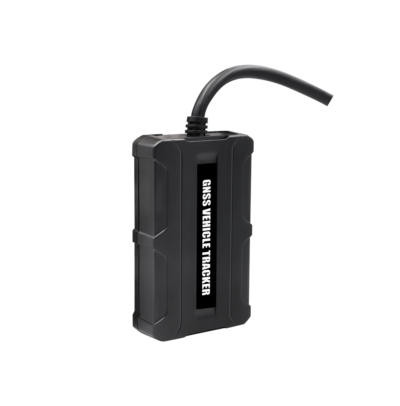

# Meitrack - T711L

The Meitrack T711L is a compact and cost effective GPS vehicle tracker designed for reliable location tracking across a range of vehicles including cars, motorcycles, yachts, and boats. The device emphasizes durability with an IP67 water resistance rating and integrated antennas to maintain performance in challenging environments. Its small size and light weight make it discreet and easy to place on vehicles where concealment or limited space is required.

As a Plaspy compatible device, the T711L can be integrated into a centralized fleet and asset management setup to surface location data and basic operational metrics. Plaspy can ingest the T711L data to provide visibility, historical routes, and event driven notifications so organizations can monitor assets, analyze driving patterns, and run day to day fleet operations from a single platform.

## Key Highlights

- IP67 water resistance for protection in wet or dusty conditions
- Compact and lightweight form factor suitable for cars motorcycles and marine craft
- Optional built in Bluetooth for expanded accessory integration
- Driving behavior analysis to support safety and fleet oversight
- Wide operating temperature range for reliable performance in varied climates
- Cost effective choice for mixed fleet deployments and personal tracking

## How It Works with Plaspy

When paired with Plaspy, the Meitrack T711L becomes a managed tracking endpoint whose position updates and status information are displayed within Plaspy dashboards and reports. Plaspy organizes data from T711L units to help teams monitor movement, respond to events, and generate operational insights.

- Live and historical location visualization for individual assets and entire fleets
- Alerts and notifications for key events configured in Plaspy such as motion or location changes
- Aggregated reports and dashboards that surface driving behavior trends and utilization
- Device grouping and filtering to manage vehicles by route region driver or business unit
- Exportable logs and summaries to support administrative and operational reporting

## Typical Use Cases

- Fleet management for light commercial vehicles and delivery cars
- Motorcycle and scooter tracking for personal security or fleet oversight
- Monitoring of boats and yachts where water resistance is required
- Covert or discreet tracking where a small device form factor is preferred
- Safety and compliance programs that use driving behavior insights to reduce risk

## Why Choose This Tracker with Plaspy

The T711L is a practical option for organizations seeking a balance of ruggedness and affordability. Its IP67 rating and compact design suit deployments where exposure to the elements and limited mounting space are concerns. The optional Bluetooth capability offers a pathway to extend the device role through compatible accessories, and built in driving behavior features help surface actionable insights for fleet safety and efficiency.

Paired with Plaspy, the T711L can be managed alongside other compatible devices to provide unified visibility and operational control. Plaspy lets teams translate device reports into dashboards, alerts, and workflows without requiring deep changes to existing operations, making the T711L a sensible choice for mixed fleets and diverse asset types.

To learn more about Plaspy and how it can work with Meitrack devices visit https://www.plaspy.com. Product specifications and availability can change over time so verify the current technical details and compatibility on the manufacturer site https://www.meitrack.com/ before planning deployments.
