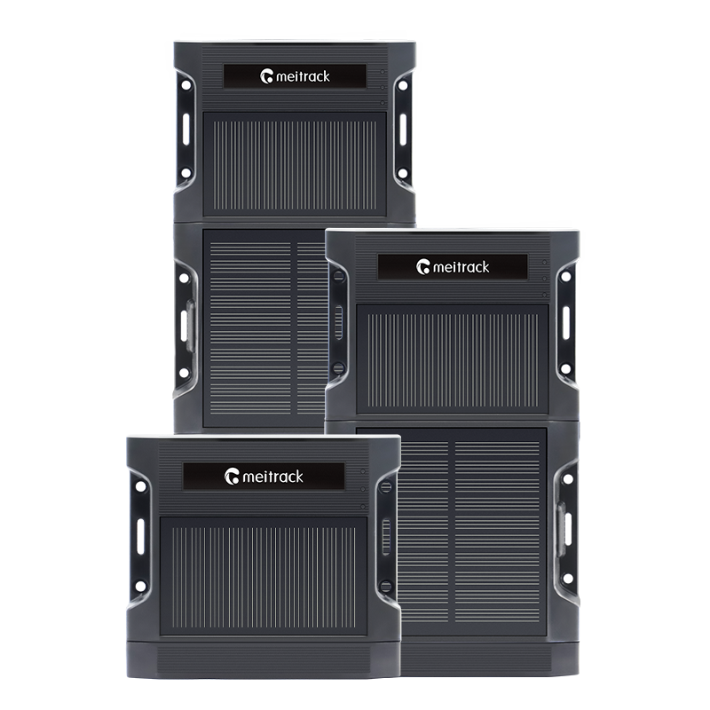

# Meitrack - TA255

# TA255 Series Solar Asset GPS Tracker

The TA255 Series is a rugged, Plaspy compatible GPS tracker engineered for long-term, low‑maintenance monitoring of trailers, containers and other high-value assets. With integrated solar charging, stackable battery modules up to 22,400 mAh and IP67 protection, the TA255 delivers reliable real-time tracking and telemetry for remote or long-haul fleet management.

The device combines multi-mode cellular \(4G/2G\), GNSS positioning, Wi‑Fi and Bluetooth connectivity with built-in sensors and peripheral interfaces so you can monitor location, fuel levels, temperature and movement through Plaspy. FOTA support and regional wireless variants simplify large deployments and keep device firmware current without manual intervention.

## Key Highlights

- Plaspy compatible GPS tracker built for unattended operation with integrated solar charging and stackable battery support \(up to 22,400 mAh\).
- Multi-network cellular: 4G \(LTE Cat 1 / Cat M1 / NB2\) plus 2G fallback for broad coverage and resilient connectivity.
- Robust environmental design — IP67 ingress protection and operating range −20°C to 60°C for harsh outdoor use.
- Comprehensive telemetry and sensor support: BLE temperature & humidity sensors, ultrasonic and voltage fuel sensors, digital temperature probes.
- Peripheral interfaces including RFID, iButton, Micro‑USB and relay outputs \(12 V/24 V\) for event control and anti-theft actions.
- Accurate GNSS positioning \(≈2.5 m\) with -162 dBm sensitivity for dependable real-time tracking in diverse environments.
- FOTA \(firmware-over-the-air\) and OTA management to update firmware and configuration remotely at scale.

## How It Works with Plaspy

Integrated with Plaspy, the TA255 Series becomes a turnkey solution for real-time tracking, telemetry collection and remote device control. The tracker streams GNSS location and sensor telemetry to Plaspy where you can visualize routes, set geofences, trigger alerts and generate reports for fleet management and anti-theft workflows.

- Real-time location and telemetry updates — GNSS fixes, movement events and sensor readings feed Plaspy dashboards for live situational awareness.
- Event and input reporting — the TA255 reports motion, drop detection and digital inputs to Plaspy for alarm, door or container status monitoring.
- Fuel monitoring — integrate ultrasonic or voltage-based fuel level sensors; Plaspy can trend consumption and alert on discrepancies.
- Remote immobilizer / ignition control — relay outputs can be used to implement remote immobilization or ignition control workflows through Plaspy where local regulations and installation allow.
- Bluetooth sensors — BLE temperature and humidity sensors pair to the tracker and pass readings to Plaspy for cold-chain and environment monitoring.

## Technical Overview

| Model | TA255 Series \(TA255E, TA255L‑E, TA255L‑AU variants\) |
| --- | --- |
| Connectivity | 4G \(LTE Cat 1 / Cat M1 / NB2\) and 2G cellular, Wi‑Fi 802.11 b/g/n \(2.4 GHz\), Bluetooth 5.0 / 4.2 |
| Bands / Regional Variants | Regional wireless variants available: TA255E \(global\), TA255L‑E \(Africa/Europe/Middle East\), TA255L‑AU \(Australia\). Supports LTE Cat 1 / M1 / NB2 and 2G where applicable. |
| Power & Battery | Stackable battery modules up to 22,400 mAh total. Charging options: magnetic charging 5.5 V / 2 A; battery box charging via I/O cable 11.4–60 V; solar tracker input max 70 mA; battery box charging max 100 mA. |
| Interfaces | Dual‑SIM \(dual card single waiting, Nano‑SIM and reserved eSIM\), Micro‑USB, RFID, iButton, relay outputs \(12 V / 24 V\), multiple sensor inputs for fuel and temperature probes. |
| GNSS | Internal GNSS antenna; positioning accuracy approx. 2.5 m; GNSS sensitivity −162 dBm. |
| Bluetooth | Bluetooth 5.0 / 4.2 for BLE sensors \(temperature, humidity, beacons\). |
| Remote Management | FOTA / OTA supported for firmware and configuration updates. |
| Form Factor & Durability | Compact: 71 × 95 × 27 mm; IP67 ingress protection; operating temperature −20°C to 60°C. |
| Memory & Sensors | 8 MB internal flash; built‑in 3‑axis accelerometer and drop detection sensors for motion and impact events. |
| Compliance | CE certified. |

## Use Cases

- Trailer and container monitoring — long battery life and solar charging minimize maintenance for long-haul fleets and intermodal assets.
- Long‑distance logistics — continuous GNSS tracking and multi-network cellular ensure route visibility and reliable telemetry reporting to Plaspy.
- Equipment and asset fleet management — movement alerts, drop detection and sensor telemetry help manage utilization and reduce theft risk.
- Fuel monitoring and efficiency — connect ultrasonic or voltage-based fuel sensors to detect theft, leakage or excessive consumption and report to Plaspy.
- Cold-chain and environment monitoring — BLE temperature and humidity sensors provide environmental telemetry for sensitive cargo while the tracker handles connectivity and reporting.

## Why Choose This Tracker with Plaspy

The TA255 Series is a purpose-built, Plaspy compatible GPS tracker for organizations that need reliable, low‑maintenance asset tracking and rich telemetry. Its stackable battery design and integrated solar charging reduce servicing frequency and keep high-value assets online across long routes and remote locations. Multi-modal connectivity \(4G/2G, Wi‑Fi, Bluetooth\) and regional variants ensure the device stays connected where your fleet operates.

For fleet managers, the TA255 delivers actionable telemetry — from fuel monitoring to temperature sensing — and supports event-driven anti-theft workflows through relay outputs and built-in motion detection. FOTA capability and Plaspy integration simplify large deployments by enabling remote updates and centralized configuration management. If you require a compact, rugged GPS tracker that scales with accessories and plays well with Plaspy for real-time tracking, telemetry and anti-theft control, the TA255 Series is designed to meet those operational needs.

