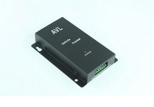

# Meitrack - VT-300

The Meitrack VT-300 is a high performance GPS GSM GPRS tracking device designed for real time vehicle tracking and fleet management. It is described as having strong GPS sensitivity and steady performance to maintain accurate location fixes even in more remote areas. The VT-300 supports multiple tracking modes and several built in alerts and safety features that help manage and secure vehicles.

As a Plaspy compatible device, the VT-300 can be integrated into a central fleet management workflow for monitoring, alerts, and reporting. Its communication capabilities, including SMS and GPRS TCP UDP using the Meiligao protocol and AGPS with GSM base station assistance, make it a practical option for organizations that want to consolidate vehicle data into Plaspy for centralized visibility and operational oversight.

## Key Highlights

- Designed for real time vehicle tracking and fleet monitoring
- High sensitivity GPS performance intended to maintain accurate fixes
- SMS and GPRS TCP UDP communication using the Meiligao protocol
- AGPS support with GSM base station ID to enhance positioning in challenging areas
- Flexible tracking modes including on demand, interval, and distance based reporting
- Built in safety and security features such as SOS panic button and geo fencing
- Multiple alert types including movement alarm, speeding alarm, power cut and low battery warnings

## How It Works with Plaspy

When paired with Plaspy, the VT-300 sends position updates and event messages that Plaspy receives and displays in a unified web platform. Plaspy processes the device data to provide map views, alerts, and historical records so fleet managers can monitor vehicles and respond to incidents.

- Live map visibility for individual vehicles and grouped fleets
- Configurable alerts in Plaspy for SOS, geo fencing, speeding, power cut and other events
- Scheduled or on demand tracking feeds to match operational needs
- Historical route playback and basic reporting for trips and events
- Centralized management of multiple VT-300 units for fleet level oversight

## Typical Use Cases

- Company car and field service vehicle monitoring for operational efficiency
- Delivery and logistics tracking to confirm locations and routes
- Rental and shared vehicle oversight with geo fencing and alerts
- Security and recovery workflows using SOS and movement alarms
- Routine fleet reporting and compliance review through historical playback

## Why Choose This Tracker with Plaspy

The VT-300 is a practical choice for teams that need reliable vehicle location reporting combined with a broad set of alerts and tracking options. Its described communication features and AGPS assistance are useful for maintaining connectivity and positioning across typical urban and rural operating areas.

Combined with Plaspy, the VT-300 provides centralized access to location data and event notifications, enabling organized fleet monitoring, alerting, and basic reporting without requiring separate point solutions. For organizations evaluating trackers, the VT-300 is worth considering when the goal is consistent vehicle visibility and straightforward integration into a hosted fleet platform.

To learn more about how the VT-300 can work in your fleet environment, visit Plaspy on the main website https://www.plaspy.com. Note that product specifications, availability, and manufacturer details can change over time, so verify current technical information and compatibility with the official manufacturer documentation at https://www.meitrack.com/.
