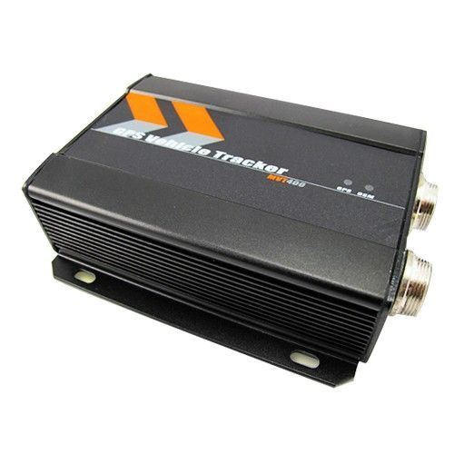

# Meitrack - VT-400

The Meitrack VT-400 is a rugged GPS/GPRS tracking device designed for heavy machinery, construction machines, and vehicles. It combines a built-in GPS receiver with GSM connectivity to obtain position data and transmit it to a specified phone or server for remote tracking and management. The unit is built to withstand demanding conditions with an IP66 waterproof rating, internal memory for logging, an inbuilt backup battery, and a physical SOS panic button for emergency situations.

As a Plaspy compatible device, the VT-400 can feed position, alarm, and status information into the Plaspy platform for centralized monitoring and operational oversight. Its suite of reporting and alarm features, along with multiple inputs and outputs and optional connectivity options, make it a practical choice for organizations that need persistent visibility of vehicles and equipment and wish to manage those assets through Plaspy's tracking and reporting tools.

## Key Highlights

- Designed for heavy equipment and vehicle tracking with an IP66 rated enclosure for harsh environments
- Built-in GPS positioning and GSM based transmission for remote data delivery
- Multiple alarm types including geo fencing, movement alarm, low battery, speeding, and GPS blind area alerts
- Internal logging and backup battery to maintain data continuity in intermittent coverage
- SOS panic button and engine cut capability for added security and emergency response
- Flexible inputs and outputs including digital and analog channels and an optional RS232 connection

## How It Works with Plaspy

When connected to Plaspy, the VT-400 supplies location and status data that Plaspy organizes for live monitoring, historical review, and automated alerting. Plaspy ingests the device data so fleet managers and operations teams can see vehicle and machinery movements on a single platform and act on events as they occur.

- Live location tracking and map visualization for central fleet oversight
- Configurable alerts in Plaspy based on device alarms such as geo fence breaches, movement, low battery, and speeding
- Historical route playback and mileage reporting using logged data from the tracker
- Device status monitoring including power and GPS signal related alarms visible in Plaspy
- Remote control actions supported by the VT-400 such as engine stop can be surfaced in Plaspy where enabled by device setup
- Scheduled reporting and automated data uploads to support operational reporting and compliance

## Typical Use Cases

- Tracking construction machines across multiple sites for utilization and location control
- Monitoring vehicle fleets for logistics, maintenance planning, and route oversight
- Theft prevention and rapid response using SOS and engine immobilization features
- Remote asset monitoring in environments with intermittent connectivity using internal logging
- Rental equipment management to track usage, location, and tamper events

## Why Choose This Tracker with Plaspy

The VT-400 pairs rugged hardware suited to tough field conditions with a broad set of monitoring and control features that make it well matched to Plaspy's fleet and asset management capabilities. Organizations that manage heavy machinery or mixed fleets will find the device's alarm set, internal logging, and input/output flexibility useful when combined with Plaspy's centralized visualization, alerting, and reporting tools.

If you want to learn more about how the VT-400 can be used with Plaspy for fleet visibility and operational oversight, visit https://www.plaspy.com for more information. Product specifications, availability, and manufacturer details can change over time, so please verify current technical specifications and compatibility on the official Meitrack website https://www.meitrack.com/.
