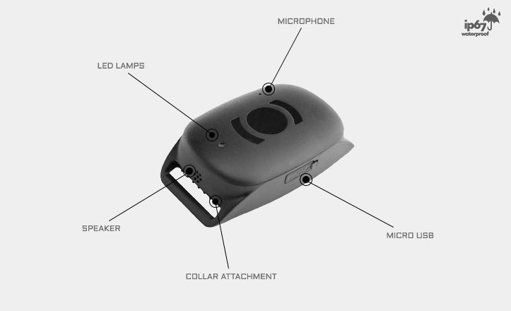

# MiniFinder - ATTO

The MiniFinder ATTO is a purpose built mini GPS tracker for pets and animals. It combines a lightweight form factor and a compact profile with a set of tracking features tailored to animal monitoring, including real time tracking, on demand tracking via SMS, geo fence alarms, passive tracking, and a bark detector. The ATTO is designed and tested for use on different kinds of animals, offering a small footprint at 65 x 34 x 16 mm and a weight of 38 g, with waterproof protection rated to IP67.

As a Plaspy compatible device, the ATTO can be integrated into Plaspy to provide continuous visibility and operational oversight for animal management. Devices can be delivered preconfigured for tracking systems and then monitored via desktop or mobile devices. When used with Plaspy, the ATTO enables location monitoring, alerting, and historical playback so owners and managers can keep closer tabs on animals without losing the benefit of the device's compact design and extended standby times.

## Key Highlights

- Designed for pets and animals with a small and lightweight profile ideal for collars and similar mounts
- Long operational life with up to 15 days in smart deep sleep tracking mode and standby time up to 20 days with no movement
- Real time tracking and tracking on demand via SMS, with support for Google Maps
- IP67 waterproof rating for durability in varied weather conditions
- Built in features such as a bark detector, passive tracking, and geo fence alarm for movement and location alerts
- Physical specifications and components include a 65 x 34 x 16 mm size, 38 g weight, micro USB charging, 900 mAh backup battery, and visible LED indicators

## How It Works with Plaspy

When used with Plaspy, the MiniFinder ATTO becomes part of a unified tracking environment for animal oversight and reporting. Plaspy consumes the device's location and status information to present real time positions on a map and to archive movement histories for later review.

- View live location and movement on Plaspy maps from desktop and mobile devices
- Configure geo fence areas and receive alerts when an animal enters or leaves a defined zone
- Access historical tracks and reports to review activity over time for behavior monitoring or logistics
- Monitor device status and indicators from Plaspy to help plan charging cycles and device maintenance
- Receive real time alerts triggered by movement, zone events, or other device alarms for prompt operational response

## Typical Use Cases

- Pet owners who want continuous location visibility and on demand tracking for a companion animal
- Animal shelters and rescues monitoring animals in foster or transport situations
- Breeders and handlers tracking animals during movement between sites or events
- Veterinary transport and mobile care providers needing location oversight for animals in transit
- Small scale working animal management where size and weight limitations are important

## Why Choose This Tracker with Plaspy

The MiniFinder ATTO is a good fit for organizations and individuals who need a discreet, animal friendly tracker paired with a monitoring platform. Its small size, tested design for animals, waterproof protection, and extended standby characteristics make it suitable for cases where comfort, durability, and battery life matter. Pairing the ATTO with Plaspy adds centralized visibility, alerting, and reporting that help turn device location data into actionable information for caretakers and managers.

Because the ATTO can be delivered preconfigured for tracking systems, onboarding into Plaspy is typically straightforward and focused on operational configuration rather than hardware setup. If your use case emphasizes compact form factor and long standby behavior alongside live tracking and geofencing, the ATTO plus Plaspy is worth evaluating.

Learn more about Plaspy on our main website https://www.plaspy.com. Product specifications, availability, and manufacturer details can change over time, so please verify current technical information on the MiniFinder manufacturer site https://minifinder.se/.
