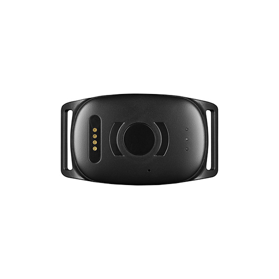

# MiniFinder - Atto Pro

The MiniFinder Atto Pro is a compact, rugged GPS tracker designed primarily for pets and livestock. Built for outdoor use with an IP67 environmental rating and a small wearable collar form factor, the device offers continuous position updates, motion aware alerts and local logging. These characteristics make the Atto Pro suitable for scenarios that require reliable location data in challenging field conditions.

As a Plaspy compatible device, the Atto Pro brings its tracking data and alerts into Plaspy's centralized monitoring environment. When integrated with Plaspy, teams and families can view live locations, configure geofences and receive motion or low battery alerts across phones, tablets and browsers, giving coordinated situational awareness for lost pet recovery, theft response and remote animal supervision.

## Key Highlights

- Plaspy compatible for real time tracking and centralized monitoring across devices
- Rugged IP67 design and lightweight collar form factor sized for pets and livestock
- Global cellular connectivity with LTE M1 NB2 and GSM to support operation across many countries
- Continuous GNSS positioning with typical outdoor accuracy reported in the 0 to 5 meter range
- Motion aware alerts, geofencing and low signal or low battery notifications for proactive monitoring
- Local flash memory for position buffering during cellular outages and automatic upload on reconnection
- BLE 5.0 support for nearby sensor integration and short range workflows

## How It Works with Plaspy

The Atto Pro transmits GNSS positions and device telemetry to Plaspy over cellular networks, and Plaspy surfaces that information in unified maps, alerts and history reports. When the unit experiences temporary network loss, built in logging holds position records and synchronizes them to Plaspy once connectivity is restored. Within Plaspy, administrators and users can create rules, review tracks and share access for collaborative monitoring.

- Real time location updates and telemetry visible in Plaspy dashboards and mobile views
- Geofence breach, motion and low battery alerts forwarded into Plaspy for immediate notification
- Local position buffering in device flash with automatic upload when the network returns
- BLE sensor or beacon integrations available for short range telemetry workflows
- Multi user access and shared alerting to support families or operations monitoring animals

## Typical Use Cases

- Lost pet recovery using collar mounted tracking and geofence notifications
- Theft protection and recovery for horses and larger animals with motion alerts and historical tracks
- Monitoring free roaming livestock on farms and pastures where local logging reduces data gaps
- Hunting dog safety and situational awareness for handlers via live positions and alerts
- Portable asset tracking for weather exposed wearable devices that need short range sensor support

## Why Choose This Tracker with Plaspy

The Atto Pro is a focused option for organizations and individuals who need a discreet, weatherproof tracker for animals and portable assets. Its compact wearable design, reliable outdoor positioning and built in logging make it a practical match for Plaspy users who require continuous monitoring, geofence management and shared alerting across teams and family members. BLE support also allows short range sensor use cases that can extend monitoring workflows within the Plaspy platform.

To learn more about how Plaspy can work with compatible devices such as the MiniFinder Atto Pro, visit the Plaspy main website https://www.plaspy.com. Product specifications, availability and manufacturer details can change over time, so please verify current technical information and regional options on the MiniFinder official site https://minifinder.se/.
