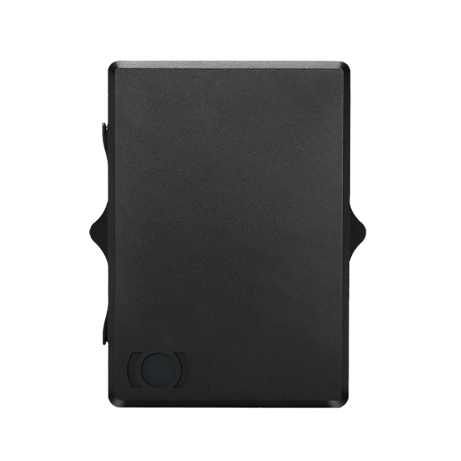

# MiniFinder - Xtreme

The MiniFinder Xtreme is a rugged, magnetic GPS tracker built for long term covert tracking of high value vehicles and equipment. Designed with an IP68 waterproof enclosure and a strong magnetic mounting, the Xtreme is intended for deployments where endurance and concealment matter. It offers reliable real time tracking and event telemetry suited to fleet management, anti theft protection, and remote asset monitoring.

As a Plaspy compatible device, the Xtreme feeds position updates and event data into Plaspy for centralized visibility and operational oversight. Its long life battery, GNSS positioning, and motion and tamper sensors provide the inputs Plaspy uses for geofencing, alerts, historical playback, and reporting so teams can monitor assets, respond to incidents, and optimize utilization.

## Key Highlights

- Rugged IP68 rated housing and strong magnetic mount for fast, installation free attachment to metal surfaces
- Long life rechargeable 7800 mAh battery designed for extended field operation depending on reporting settings
- Qualcomm Gen 8C GNSS receiver for fast and accurate position fixes in outdoor environments
- Built in motion detection and tamper alarms to support anti theft workflows and event driven reporting
- Covert, compact form factor suitable for trailers, boat outboards, ATVs, snowmobiles, and portable equipment
- Internal logging capability and visible indicators for on device status and basic troubleshooting

## How It Works with Plaspy

When integrated with Plaspy, the MiniFinder Xtreme delivers location and event telemetry into a single platform for live tracking, alerts, and post event analysis. Plaspy converts the tracker inputs into map views, configurable notifications, and stored history that teams can use for operational decisions and incident response.

- Real time location and telemetry displayed on Plaspy maps for live asset visibility
- Geofence entry and exit alerts forwarded to Plaspy for instant notifications and workflow triggers
- Tamper and low battery notifications routed into Plaspy alarm channels for timely response
- Historical position logging and playback available for route review and investigations
- Event driven reporting that balances update frequency with battery life based on configured rules

## Typical Use Cases

- Covert tracking of trailers and cargo to prevent theft and assist recovery
- Protection and remote monitoring of boat outboards and marine assets in harsh environments
- Security and seasonal tracking for ATVs, snowmobiles, and powersport equipment
- Monitoring of worksite equipment and portable machinery for utilization and unauthorized movement
- Fleet management for mixed assets that require discrete, long endurance tracking

## Why Choose This Tracker with Plaspy

The MiniFinder Xtreme is a practical fit for organizations that need durable, discreet tracking combined with a platform for centralized monitoring. Its rugged enclosure, magnetic mount, and long endurance make it suitable for assets exposed to weather and rough handling, while Plaspy provides the tools to turn location and event data into actionable insights for theft prevention and fleet efficiency.

To learn more about how Plaspy works with compatible devices like the MiniFinder Xtreme, visit https://www.plaspy.com. Product specifications and availability can change over time, so please verify current technical details and accessory options on the manufacturer site https://minifinder.se/.
