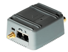

# Mtx - MTX Tunnel

The MTX Tunnel GPS is a versatile device designed for integration into fleet control systems that rely on GPS positioning and GPRS communication. When installed in a vehicle, it continuously captures GPS positions and sends them periodically to a TCP/IP server or Http Get webserver via GPRS communication. However, its capabilities extend beyond this basic functionality.

The MTX Tunnel GPS v2 software inherits many features from the well-known MTX Tunnel v5. It serves as a GPRS-RS232 gateway, allowing transparent communication between devices connected via RS232 and remote servers in TCP Server mode. Additionally, it supports Telnet for remote device configuration and state reading, providing convenient remote access. The device also offers total control via SMS, allowing users to send commands and receive information through text messages.

Other notable features of the MTX Tunnel GPS include GSM cell tracking in case of GPS coverage loss, the ability to send telemetries such as digital inputs, a low power mode for efficient operation, a firewall to prevent unauthorized access, and support for GPRS-I2C/SPI and SMS-RS232 tunnels. The device also incorporates SSL security for secure communication and an API for seamless integration with third-party applications.

