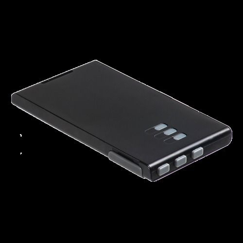

# Navigil - PT220

The Navigil PT220 is a compact and reliable GPS tracker designed primarily to track the location and help ensure the safety of people. It is intended for straightforward personal use and can be carried in a pocket, briefcase, or backpack. The device is designed for simple deployment using a SIM card and offers rechargeable power via a wall charger or USB connection, making it convenient for daily use or temporary deployments.

As a Plaspy compatible device, the PT220 fits naturally into Plaspy workflows that require location visibility, periodic reporting, and event driven alerts. Its configurable operation modes allow it to send periodic location reports or respond to queries and events, which Plaspy can ingest to provide mapping, alerts, and reporting for operators managing people or small mobile assets.

## Key Highlights

- Designed for personal safety and people tracking with a compact portable form factor.
- Easy deployment workflow requiring a SIM card and access configuration.
- Rechargeable internal battery with convenient charging via wall charger or USB.
- Configurable reporting modes including automatic periodic reporting and manual query options.
- Intelligent power management and low power sleep modes for extended operation between charges.
- Event based reporting capabilities such as geofence breach notification and scheduled wake events.

## How It Works with Plaspy

The PT220 can feed location and event reports into Plaspy so teams can monitor individuals or small asset groups from a central platform. Plaspy displays incoming location updates, preserves history, and can generate notifications based on the events the device sends.

- Display live and recent location updates on Plaspy maps for operational visibility.
- Trigger alerts and notifications in Plaspy from event messages such as geofence breaches.
- Review historical tracks and export location reports for audits and operational review.
- Monitor device state and reporting frequency through Plaspy dashboards to maintain oversight.
- Combine PT220 location data with rules and reporting tools in Plaspy for daily operations and safety monitoring.

## Typical Use Cases

- Personal safety monitoring for children, elderly family members, or lone workers.
- Temporary tracking of personnel during events or field operations.
- Keeping track of personal belongings, bags, or portable equipment in transit.
- Short term deployments where quick setup and recharge convenience are required.
- Operational oversight for small teams or contractors that need location visibility.

## Why Choose This Tracker with Plaspy

The PT220 is a practical choice for organizations and families that need a simple, portable tracking device paired with a full featured platform. Its focus on ease of use, rechargeable power, and flexible reporting modes makes it suitable for personal safety and lightweight operational monitoring. Integrated with Plaspy, the PT220's location and event messages become part of a broader monitoring, alerting, and reporting workflow.

Because public product descriptions are concise, the PT220 is presented here in general terms to reflect its primary strengths without overstating specific telemetry. If you are evaluating device options for Plaspy integration, the PT220 offers a straightforward balance of portability, configurable reporting, and battery longevity that complements Plaspy's mapping and alerting capabilities.

Learn more about Plaspy on the main website https://www.plaspy.com. Product specifications, availability, and manufacturer details can change over time, so please verify current information on the manufacturer's site http://www.navigil.com/ before making procurement or deployment decisions.
