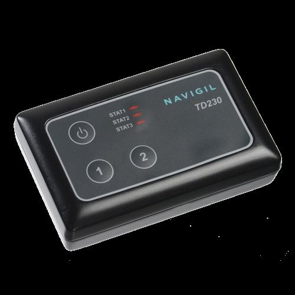

# Navigil - TD230

The Navigil TD230 is an OEM tracking device that offers fast time to market for businesses looking to incorporate GPS tracking into their products. With the standard TD230 TG2 firmware and a rebranded user interface membrane, companies can bring their tracking solutions to market in a matter of weeks. The membrane can be easily customized with a low-cost rebranding, allowing for a personalized touch. Navigil offers various button and LED layouts for the membrane, providing flexibility for different applications.

One of the standout features of the TD230 is its intelligent software. The device comes with a production-ready firmware that supports commonly used features such as geofences, vehicle state monitoring, server reporting, and power-saving logic. The firmware and all configuration files can be upgraded over-the-air, ensuring that the device stays up to date with the latest features and improvements. Additionally, the TD230 offers an SDK for further customization, allowing businesses to tailor the device to their specific needs.

Another key advantage of the TD230 is its long battery life. Thanks to the low-power sleep modes of the hardware and intelligent power management of the firmware, the device can operate for extended periods without external power. This is particularly useful in applications where the device needs to be deployed in remote or hard-to-reach locations. The TD230 can maintain periodic communication with a back-end server while conserving battery life. It can be woken up from a power-saving mode by a scheduled event, mechanical motion, or an external input, ensuring that it remains responsive when needed.

