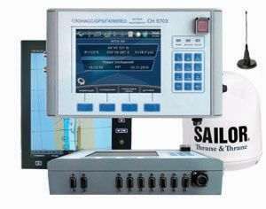

# Navis - CH -5703

The Navis CH -5703 is a marine navigation instrument designed for river and sea vessels. It combines GNSS reception across major satellite systems with differential corrections and provides fundamental navigation parameters such as current coordinates, date and time, speed over ground, and track angle. The device is intended to operate as part of a vessel monitoring set or as a component of an equipment control center, and it supports data exchange with shipboard systems including ECDIS, AIS when used with ECDIS, and other compatible control systems.

As a device that can transmit short text and coded messages to a control center and support map updates, the CH -5703 is relevant for use with Plaspy as a source of location and messaging data for fleet monitoring. Its marine focus and integration points make it a practical option for organizations that want to consolidate vessel navigation and status information in Plaspy for operational visibility and traffic monitoring across waterways.

## Key Highlights

- Integrated GNSS reception including GPS GLONASS and GALILEO with support for differential corrections for marine use.
- Designed specifically for river and sea vessels as a NAP GNSS receiver and DGPS marine differential subsystem.
- Provides essential navigation outputs such as position, time, speed over ground, and track angle for monitoring.
- Supports generation and transmission of short text and coded messages to a control center for operational communication.
- Integrates with ECDIS and can interoperate with AIS via ECDIS for enhanced situational awareness.
- Can function as part of an equipment control center or as a response device paired with a DC supervisor.
- Compatible with a variety of control systems where a data interface is available, enabling flexible deployment.

## How It Works with Plaspy

When used with Plaspy, the CH -5703 supplies vessel navigation and messaging information that Plaspy can use to display and analyze fleet movements. Plaspy can ingest the device data to provide unified visibility, reporting, and alerts that support fleet operations and traffic monitoring.

- Live position and course display on Plaspy maps to track vessel locations in real time.
- Historical track playback and reporting to review movements and generate activity reports.
- Forwarding of device messages and status reports into Plaspy alerts and operator notifications.
- Integration of ECDIS and AIS related information into Plaspy dashboards to improve situational awareness.
- Centralized operational oversight combining CH -5703 data with other assets and datasets managed in Plaspy.

## Typical Use Cases

- Fleet monitoring for river and coastal operators who need continuous vessel location and movement visibility.
- Traffic monitoring in ports and inland waterways where coordinated oversight is required.
- Vessel to control center messaging for status reporting and short operational communications.
- Integration into shipboard monitoring sets and control centers for combined navigation and monitoring workflows.
- Enhancing situational awareness on vessels by supplying navigation parameters to onboard or shore based systems.

## Why Choose This Tracker with Plaspy

The CH -5703 is a purpose built marine GNSS receiver that aligns with common needs for vessel tracking and traffic monitoring. Its ability to provide corrected position data, navigation parameters, and message transmission makes it a practical choice for operators who require reliable location inputs and basic communications as part of a broader fleet management strategy. When paired with Plaspy, organizations can centralize vessel data for monitoring, reporting, and operational decision making across river and sea operations.

To learn more about how Plaspy can work with marine navigation devices and fleet tracking workflows visit https://www.plaspy.com. Product specifications, availability, and manufacturer details can change over time, so please verify current specifications with the manufacturer documentation at http://navis.ru/.
