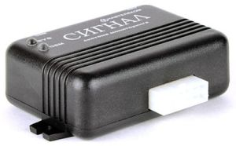

# Navtelekom - СИГНАЛ S-2115

The Navtelekom СИГНАЛ S-2115 is a vehicle monitoring GPS tracker designed for security focused fleets and individual vehicles. It combines GLONASS and GPS satellite positioning with GSM communications to provide location reporting and alarm delivery. Onboard features described by the manufacturer include an internal accelerometer for impact and tilt detection, SMS and voice alarm delivery, remote configuration via SMS/DTMF/voice, and a USB interface for local configuration and firmware updates. The S-2115 is listed as discontinued and is typically used in legacy or archived deployments where proven basic tracking and alerting are required.

As a Plaspy compatible device, the S-2115 can feed position fixes and event notifications into Plaspy for centralized monitoring and operational oversight. Plaspy can ingest the device reports to show live and historical locations, surface accelerometer based alarms, and include S-2115 units in fleet reports and alerting workflows. For organizations running mixed fleets or maintaining archived hardware, the S-2115 provides a straightforward data source that Plaspy can incorporate into dashboards and logs.

## Key Highlights

- GLONASS and GPS satellite positioning combined with GSM communications for location reporting.
- Internal accelerometer provides impact tilt and movement detection useful for alarm generation.
- Multiple alarm delivery methods including SMS and voice notifications to reach operators quickly.
- Remote control and diagnostics via SMS, DTMF, and voice menu options for infield parameter changes.
- USB interface for local configuration and firmware maintenance using the vendor configurator.
- Intended for fleet management and vehicle anti theft monitoring and documented as archived hardware.

## How It Works with Plaspy

When connected to Plaspy, the SIGNAL S-2115 supplies position and event data that Plaspy uses to maintain situational awareness and operational records. Plaspy maps incoming location updates, timestamps accelerometer events, and integrates the device alerts into configurable notification and reporting channels.

- Live location tracking displayed on Plaspy maps using GNSS position reports from the tracker.
- Immediate incident notifications for shocks, tilts, or unauthorized movement routed into Plaspy alert workflows.
- Alarm messages delivered via SMS or voice can be accepted by Plaspy ingestion methods or used in parallel for operator escalation.
- Remote query and parameter changes by SMS or DTMF can be included in operational procedures coordinated through Plaspy.
- Local USB configuration and firmware preparation before onboarding simplify integration of archived units into Plaspy.

## Typical Use Cases

- Fleet management for routing, dispatch visibility, and historical location reporting.
- Vehicle anti theft monitoring with accelerometer triggered alerts and immediate notifications.
- Incident logging and forensic review of shocks or collisions for maintenance planning.
- Remote status queries and simple device control during operations without physical access.
- Integration of legacy or archived trackers into a centralized Plaspy monitoring environment.

## Why Choose This Tracker with Plaspy

The SIGNAL S-2115 offers a no frills, proven approach to location reporting and basic alarm handling that fits well where straightforward telemetry and alerting are the primary needs. In Plaspy, the S-2115 can serve as a reliable data source for mapping, alert escalation, and historical logs for fleets that do not require complex telemetry or modern sensor suites.

To learn more about how Plaspy supports trackers like the SIGNAL S-2115 please visit https://www.plaspy.com. Product specifications, availability, and manufacturer details can change over time, so verify current capabilities and archived documentation on the official Navtelekom site https://www.navtelecom.ru/.
