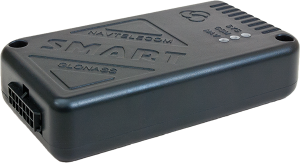

# Navtelekom - СМАРТ S-2333A HIT

The СМАРТ S-2333A HIT is a compact earlier generation GLONASS GPS vehicle tracker designed for reliable position reporting and basic telemetry. Although discontinued, the unit includes integrated high sensitivity GNSS and GSM antennas, a built in rechargeable backup battery, and a range of configurable inputs and outputs that make it suitable for vehicle and small asset tracking, anti theft workflows, and environments where space for external antennas is limited.

This model remains relevant as a Plaspy compatible device when legacy hardware must be retained within a modern monitoring stack. The S-2333A HIT can feed location updates, discrete events and sensor readings into Plaspy using standard telematics workflows over GSM, allowing fleets and operators to maintain continuity of service while consolidating tracking and alerting in Plaspy dashboards.

## Key Highlights

- Compatible with Plaspy through common telematics data flows over GSM for live tracking and reporting.
- Integrated GLONASS GPS and GSM antennas reduce the need for external antenna routing and simplify concealment.
- Built in rechargeable backup battery keeps reporting active during temporary power interruptions.
- Multiple configurable inputs and outputs enable ignition detection, event reporting and basic remote control functions.
- RS-485 and 1-Wire interfaces allow connection of third party sensors and probes for expanded telemetry.
- Well documented by the manufacturer with published firmware and configuration utilities for ongoing maintenance.
- Compact form factor suited for vehicle installations and small asset concealment.

## How It Works with Plaspy

When connected into a Plaspy deployment, the СМАРТ S-2333A HIT transmits GNSS position fixes and telemetry over its GSM link to Plaspy ingestion points using standard telematics formats. Plaspy consumes location updates, input events and peripheral sensor data to present live maps, historical playback and event driven alerts for operational oversight and reporting.

- Real time location and telemetry updates for live tracking and route history in Plaspy.
- Ignition and event monitoring through digital inputs to support route analytics and usage reporting.
- Analog and frequency pulse inputs can be used with supported peripherals to report fuel or flow related signals into Plaspy.
- Configurable outputs enable remote control actions such as immobilizer workflows when integrated into Plaspy alerts.
- External sensors connected via RS-485 or 1-Wire feed temperature and other telemetry into Plaspy for broader monitoring.

## Typical Use Cases

- Fleet tracking for small to medium sized vehicle groups needing basic live location and history.
- Anti theft and immobilization scenarios using event alerts and configurable outputs.
- Fuel monitoring and consumption analysis when used with compatible analog or pulse sensors.
- Environmental or temperature monitoring through RS-485 or 1-Wire connected probes.
- Supporting legacy vehicle fleets where discontinued but documented hardware must remain in service.

## Why Choose This Tracker with Plaspy

The СМАРТ S-2333A HIT is a pragmatic option for organizations that need to integrate legacy Navtelekom hardware into a unified Plaspy monitoring environment. Its built in antennas and compact design reduce installation complexity, while the internal backup battery and multiple I O options provide resilience and flexibility for common fleet and anti theft workflows. For integrators managing mixed hardware estates, the S-2333A HIT can extend the useful life of installed trackers while delivering core Plaspy compatible capabilities such as live tracking, event alerts and telemetry ingestion.

To learn more about how Plaspy can work with legacy and modern trackers visit https://www.plaspy.com. Product specifications and availability can change over time, so verify the most current technical details and official documentation on the manufacturer website https://www.navtelecom.ru/.
