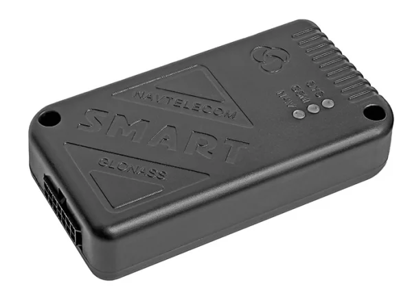

# Navtelekom - СМАРТ S-2422

The SMART S-2422 is a compact vehicle GLONASS/GPS tracker designed for robust fleet management and seamless integration with Plaspy. Built with sensitive on-board GLONASS/GPS and GSM antennas, the S-2422 delivers reliable real-time tracking and telemetry for vehicles without relying on an internal battery—making it ideal for permanently wired installations that require continuous data for routing, reporting, and anti-theft workflows.

Plaspy compatible out of the box, the SMART S-2422 connects vehicle sensors, external fuel probes and accessories to deliver location, sensor telemetry and remote control actions into Plaspy dashboards and alerts. With industrial-grade input protection and flexible digital I/O plus Bluetooth 4.0 for short-range accessory setup, this tracker supports practical fleet tracking, fuel monitoring and remote equipment control use cases.

## Key Highlights

- Plaspy compatible GPS tracker for dependable real-time tracking and fleet management integration.
- Dual GLONASS/GPS positioning with integrated sensitive antennas for consistent location updates.
- 2G GSM modem with single SIM slot for cellular connectivity and telemetry transmission to Plaspy.
- Extensive vehicle I/O: three universal digital inputs and two configurable control outputs for sensor and actuator integration.
- RS-485 and 1-Wire interfaces for external fuel level sensors \(DUT\) and other telemetry devices.
- Bluetooth 4.0 for local configuration and accessory connectivity \(short-range\).
- Robust power protection and input-line protection up to 200 V for demanding vehicle electrical environments.

## How It Works with Plaspy

When integrated with Plaspy, the SMART S-2422 feeds continuous location and vehicle telemetry to the platform so dispatchers and managers can monitor assets in real time. The tracker sends GNSS coordinates and sensor readings over the 2G GSM link to Plaspy servers where data is visualized, logged, and used to trigger alerts and reports. The device’s digital inputs, RS-485 and 1-Wire ports bring vehicle events and fuel telemetry into Plaspy for actionable insights.

- Real-time location and telemetry updates \(GLONASS/GPS → cellular → Plaspy\).
- Digital input event reporting \(e.g., ignition, door or alarm inputs configurable through Plaspy rules\).
- Fuel monitoring via external sensors connected over RS-485 \(DUT\) with telemetry sent to Plaspy.
- Remote control and immobilizer-style actions via configurable control outputs when wired into vehicle systems.
- Bluetooth 4.0 for local configuration and accessory pairing; works alongside Plaspy-managed configuration.
- Remote firmware management through the DRC system to keep devices updated and compatible with Plaspy integrations.

## Technical Overview

| Connectivity | 2G GSM modem \(single SIM slot\); GLONASS/GPS |
| --- | --- |
| Bands | Not specified in the manufacturer description |
| Power & Battery | No internal battery; powered from vehicle electrical system. Robust power protection and input-line protection up to 200 V. |
| Interfaces | 3 universal digital inputs; 2 configurable control outputs; RS-485 interface \(for fuel sensors / DUT\); 1-Wire interface |
| GNSS | GLONASS and GPS with built-in sensitive GNSS antenna \(accuracy per manufacturer documentation\) |
| Bluetooth | Bluetooth 4.0 \(BLE\) for local configuration and short-range accessories |
| Remote Management | Configurable with NTC Configurator; supports remote firmware management via DRC system |
| Form Factor | Vehicle-mounted unit with integrated GLONASS/GPS and GSM antennas suitable for fleet installations |

## Use Cases

- Fleet tracking and routing — monitor vehicle locations in real time within Plaspy dashboards.
- Anti-theft and remote immobilization — control outputs can be used to implement immobilizer-style protections when wired to vehicle systems.
- Fuel monitoring and telemetry — connect external DUT/fuel level sensors via RS-485 for continuous fuel monitoring and reporting to Plaspy.
- Remote equipment control — trigger relays or control devices via configurable outputs for on-demand actions reported to Plaspy.
- Short-range Bluetooth sensor integration and local configuration for service technicians at the vehicle.

## Why Choose This Tracker with Plaspy

The SMART S-2422 combines resilient vehicle-grade hardware with the telemetry and control features fleet operators expect from a Plaspy compatible GPS tracker. Its integrated GLONASS/GPS antennas and wired power approach suit vehicles that require persistent, uninterrupted tracking. With RS-485 and 1-Wire support you gain straightforward fuel monitoring and sensor telemetry; digital I/O and configurable outputs extend control capabilities for anti-theft and immobilizer-style functions. Administrators benefit from remote firmware management through DRC and local configuration via NTC Configurator, simplifying deployment and lifecycle management across large fleets. In short, the SMART S-2422 is a practical, reliable option for operators seeking accurate real-time tracking, telemetry and vehicle integration within the Plaspy ecosystem.

