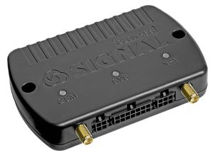

# Navtelekom - СИГНАЛ S-2654

The SIGNAL S-2654 is a GLONASS vehicle tracker from the SIGNAL product line designed for fleet management and industrial telemetry. Built around a built-in 3G modem and dual-SIM redundancy, the S-2654 delivers reliable position reporting, local logging and extensive I/O for telematics integrations. As a Plaspy compatible GPS tracker, it integrates securely into Plaspy's real-time tracking and reporting workflows to help fleets, service vehicles and mobile assets stay visible, auditable and protected.

Note: the S-2654 is listed as discontinued \(archived\) by the manufacturer, but documentation, configuration tools and firmware history remain available via the manufacturer’s resources \(Navtelecom website, NTC Configurator and the DRC remote management system\). For deployments that require proven GLONASS positioning, robust input protection and industrial communications \(RS-232/RS-485/CAN/MODBUS\), the S-2654 remains a practical option to connect into Plaspy for real-time tracking, anti-theft workflows and telemetry-driven fleet optimization.

## Key Highlights

- Plaspy compatible GLONASS vehicle tracker with built-in 3G modem for real-time tracking and telemetry delivery.
- Dual-SIM support and external antenna connections \(GLONASS/GPS and GSM\) for reliable cellular connectivity and signal performance.
- Local data logging via microSD card support \(up to 32 GB\) and an 800 mAh Li‑Po backup battery for temporary autonomous operation.
- Comprehensive I/O and industrial interfaces — six universal inputs, four configurable outputs, RS-232, RS-485, CAN bus and 1-Wire — to support ignition sensing, sensors and actuators.
- MODBUS support enables integration with third-party controllers and fuel or sensor telemetry systems over serial/CAN networks.
- Robust input power and line protection, including protection up to 200 V, tailored for vehicle and industrial power environments.
- Manufacturer resources and remote management available: product passport, manuals, NTC Configurator and DRC firmware/version history.

## How It Works with Plaspy

Integrating the SIGNAL S-2654 with Plaspy brings high-frequency location updates and rich telemetry into a single fleet management console. The device sends GNSS fixes and serial/CAN telemetry over its 3G modem; Plaspy ingests that data to provide live maps, alerts, reports and historical playback. Local SD logging provides a backup stream that can be reconciled if network connectivity is temporarily unavailable.

- Real-time location and telemetry updates transmitted via 3G modem to Plaspy for tracking, geofencing and route history.
- Ignition and digital input monitoring — universal inputs can detect ignition, door or alarm status for event-based alerts in Plaspy.
- Fuel monitoring and sensor telemetry via MODBUS or CAN integration with third-party fuel sensors or controllers.
- Remote immobilizer or anti-theft workflows implemented using configurable output lines controlled from Plaspy or local logic.
- Local logging on microSD \(up to 32 GB\) provides buffered data that Plaspy can reconcile after connectivity restores.

## Technical Overview

| Connectivity | Built-in 3G modem; external GLONASS/GPS and GSM antenna support; dual-SIM for redundant cellular connectivity. |
| --- | --- |
| Bands | Not specified in provided documentation. |
| Power & Battery | Internal Li‑Po battery, 800 mAh; robust input power protection and input line protection up to 200 V. |
| Interfaces | 6 universal inputs; 4 configurable output lines; RS-232; RS-485; CAN bus; 1-Wire. |
| GNSS | GLONASS support with external GNSS antenna option; GPS external antenna support noted. Position accuracy not specified. |
| Bluetooth | No built-in Bluetooth listed in the device documentation. |
| Remote Management | Firmware versions and update history accessible via DRC remote management; NTC Configurator utility for device configuration. |
| Storage | microSD card support up to 32 GB for local logging. |
| Protocols | MODBUS support for integration with third-party equipment and controllers. |
| Form Factor | Vehicle/asset tracker with external antenna connections; designed for fleet and industrial telematics. |

## Use Cases

- Fleet management: live vehicle tracking, route playback and operational reports for medium and large fleets using Plaspy dashboards.
- Anti-theft and immobilization: configurable outputs can be used to implement remote immobilizer actions and event-driven shutdowns via Plaspy controls.
- Telemetry and fuel monitoring: connect fuel sensors or engine controllers through MODBUS, CAN or serial links to collect consumption and engine telemetry.
- Industrial vehicle and asset integration: use RS-232/RS-485 and 1-Wire interfaces to collect sensor data from equipment and forward it to Plaspy for analytics.
- Offline logging and reconciliation: microSD local logs capture trips during coverage gaps; Plaspy reconciles records when connectivity returns.

## Why Choose This Tracker with Plaspy

The SIGNAL S-2654 pairs industrial-grade I/O and communications with Plaspy’s modern tracking platform to deliver practical fleet telematics and anti-theft workflows. Its dual-SIM 3G modem and external antenna support reduce downtime and improve signal resilience, while the universal inputs, serial buses and MODBUS compatibility make it straightforward to collect engine, fuel and sensor telemetry. Local SD logging and an internal backup battery add resilience for real-world vehicle deployments. Although the model is archived by the manufacturer, documentation, configuration tools \(NTC Configurator\) and firmware history via DRC help integrators and fleet operators maintain reliable operation within Plaspy-managed systems.

For operations that require Plaspy compatible GPS tracker hardware with strong industrial interfaces, rich telemetry options and built-in data redundancy, the S-2654 remains a solid option to add reliable location awareness, fuel and sensor telemetry, and anti-theft capabilities to your fleet management program.

