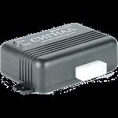

# Navtelekom - Signal S-2115

The Navtelekom Signal S-2115 is a versatile GSM-monitoring system that combines transport search and security functions with remote control capabilities. This GPS tracker utilizes satellite communication technologies of GPS/GLONASS to provide accurate and real-time monitoring of your vehicle's location, movement, and speed. With its built-in accelerometer, the S-2115 can detect and record any mechanical impacts on the vehicle, such as kicks or being loaded onto a tow truck. In the event of unauthorized access or alarms, the device can alert the user through SMS or voice messages.

One of the standout features of the Signal S-2115 is its ability to provide emergency information to predetermined subscribers in case of a robbery or other emergency situations. By simply pressing the alarm button, the driver or passengers can send out distress signals to notify designated contacts. Additionally, the S-2115 offers remote control capabilities for external devices connected to its output lines, such as a motor lock or siren. This allows for enhanced security and control over your vehicle.

With its USB interface, the Signal S-2115 can be easily connected to a PC for further customization and configuration. The device also supports remote management through voice menus, tone dialing, and SMS commands. Furthermore, the S-2115 offers the option to connect a backup power supply, ensuring continuous operation even in the event of a power outage or failure. Overall, the Navtelekom Signal S-2115 is a reliable and feature-packed GPS tracker that provides comprehensive monitoring, security, and control for your vehicle.

