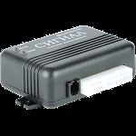

# Navtelekom - Signal S-2117

The Navtelekom Signal S-2117 is a vehicle tracking device designed for car and fleet monitoring. It combines GSM communications with GLONASS and GPS positioning to provide continuous location tracking, movement monitoring, and runtime analysis. The unit supports integration with multiple sensors and peripherals, including digital fuel gauges via an RS-485 interface and digital temperature and identification sensors through a 1-Wire interface. Its feature set also covers alarm reporting for unauthorized access and mechanical impacts, plus emergency notifications and a panic button for rapid response.

As a Plaspy compatible device, the Signal S-2117 can feed location, event, and sensor data into Plaspy for centralized fleet oversight. Plaspy users can take advantage of the tracker s core capabilities inside the platform to improve vehicle security, monitor fuel usage, keep track of temperature sensitive cargo, and respond to driver emergencies. The device s voice connection and remote control features extend operational options that can be reflected in Plaspy workflows and alerts.

## Key Highlights

- Combined GSM and GLONASS GPS positioning for reliable location and movement monitoring
- RS-485 support for up to three digital fuel gauges to enable fuel level and consumption visibility
- 1-Wire connectivity for digital temperature sensors and identification devices
- Built in speakerphone and panic button for direct voice connection between control center and driver
- Remote control of vehicle systems such as sirens, immobilizer and doors for rapid response
- Backup power supply capability to maintain operation during vehicle power interruptions
- Alerts for unauthorized access, mechanical impacts, and emergency incidents

## How It Works with Plaspy

When linked with Plaspy, the Signal S-2117 streams position, event and sensor information to the Plaspy platform where it becomes part of a unified fleet picture. Plaspy aggregates the tracker s data to provide searchable history, alerting, and operational reporting for fleets and vehicle operators.

- Live and historical location tracking visible on Plaspy maps for fleet situational awareness
- Event and alarm forwarding into Plaspy notifications for unauthorized entry, impacts, and panic triggers
- Fuel gauge readings integrated into Plaspy reports to monitor consumption and detect anomalies
- Temperature sensor data available in Plaspy for monitoring temperature sensitive cargo or equipment
- Remote output controls and device commands coordinated through Plaspy to manage sirens, immobilizers, and doors
- Speakerphone and emergency call events logged in Plaspy to support incident handling and response workflows

## Typical Use Cases

- Fleet vehicle security and real time tracking for businesses managing multiple cars or vans
- Fuel monitoring for operations where accurate consumption data reduces costs and shrinkage
- Monitoring of temperature sensitive goods in transit using connected digital temperature sensors
- Driver identification and shift logging for transport operations that require personnel tracking
- Emergency response and driver safety workflows using the panic button and voice connection
- Remote control and immobilization for theft prevention and vehicle recovery processes

## Why Choose This Tracker with Plaspy

The Signal S-2117 is a practical choice for organizations that need a mix of position tracking, sensor integration, and in vehicle voice communication. Its capacity to connect several fuel gauges and temperature sensors makes it suitable for operations where telemetry beyond basic location is important. The combination of alarm reporting, backup power capability, and remote control features supports security conscious deployments and continuous monitoring needs.

Paired with Plaspy, the S-2117 becomes part of a managed fleet platform where location, sensor data, alerts, and remote actions can be correlated and acted on from a single interface. For fleets that require fuel oversight, temperature monitoring, and direct communication with drivers, this tracker presents a balanced feature set that aligns with those operational priorities. For the most current technical specifications and availability confirm details with the manufacturer and consider how the device s capabilities match your Plaspy configuration goals.

To learn more about Plaspy and how compatible devices like the Signal S-2117 can be used in fleet tracking and monitoring, visit https://www.plaspy.com. Product specifications and availability can change over time, so please verify current details on the manufacturer s official site https://www.navtelecom.ru/ before making procurement decisions.
