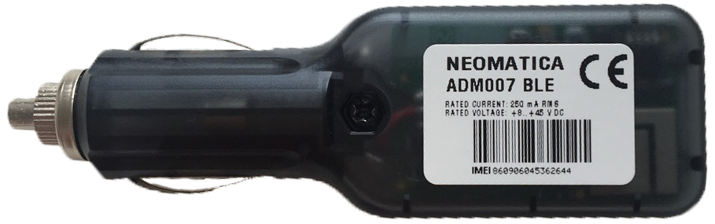

# Neomatica - ADM007 BLE CL

The ADM007 BLE CL from Neomatica is a compact car tracker designed for straightforward vehicle monitoring. Its plug-in form factor for the cigarette lighter makes the unit easy to place and remove, while the small body keeps it discreet. The device is optimized for low data consumption, typically using about 8 to 10 MB per month, and supports wireless sensor connections to extend monitoring capabilities without complex wiring.

As a Plaspy compatible device, the ADM007 BLE CL can feed location and sensor information into the Plaspy platform for centralized visibility and operational oversight. Its combination of accurate positioning, jamming detection, and support for multiple wireless sensors makes it a practical option for businesses and individual users wanting economical, long term tracking integrated with Plaspy's fleet and asset management tools.

## Key Highlights

- Compact cigarette lighter form factor for quick and noninvasive installation
- Very low monthly data consumption typically in the 8 to 10 MB range
- Support for up to 8 wireless sensors within an extended wireless range
- Fast and accurate location determination suitable for urban and rural use
- Built in jamming detection to help identify potential signal interference
- External SIM slot and Bluetooth management for convenient access and configuration
- Capacity to store a large number of route records for history and playback

## How It Works with Plaspy

When the ADM007 BLE CL is paired with Plaspy, vehicle location and available sensor data are transmitted to Plaspy for display, analysis, and alerting. Plaspy aggregates this input to provide real time visibility, historical playback, and operational reporting across your fleet or vehicle list.

- Map visualization of current vehicle position and movement history
- Sensor data integration from connected wireless sensors for extended telemetry
- Alerts for events such as signal jamming or notable location changes
- Historical route playback using stored route records to review trips and stops
- Low data usage advantages reflected in cost conscious continuous monitoring
- Local Bluetooth management complements remote monitoring through Plaspy

## Typical Use Cases

- Fleet vehicle tracking where easy installation and removal is required
- Rental or shared vehicles needing discreet and economical monitoring
- Long term monitoring applications that benefit from low data consumption
- Service and delivery vehicles that can use additional wireless sensors for operational oversight
- Organizations requiring jamming detection as part of security monitoring

## Why Choose This Tracker with Plaspy

The ADM007 BLE CL is a practical choice for organizations and individuals who prioritize a compact, economical tracker that can be rapidly deployed without permanent installation. Its ability to connect multiple wireless sensors extends what can be monitored beyond location alone, while the external SIM slot and Bluetooth management make administration straightforward.

Paired with Plaspy, the ADM007 BLE CL offers a balanced solution for visibility, reporting, and alerts without imposing high connectivity costs. Plaspy users gain a consistent view of vehicle movements, access to historical routes, and sensor driven insights that support fleet operations and asset control.

If you want to explore how the ADM007 BLE CL can work within Plaspy, learn more about Plaspy on the main website https://www.plaspy.com. Product specifications and availability can change over time, so please verify current technical details and compatibility on the manufacturer site https://neomatica.com/.
