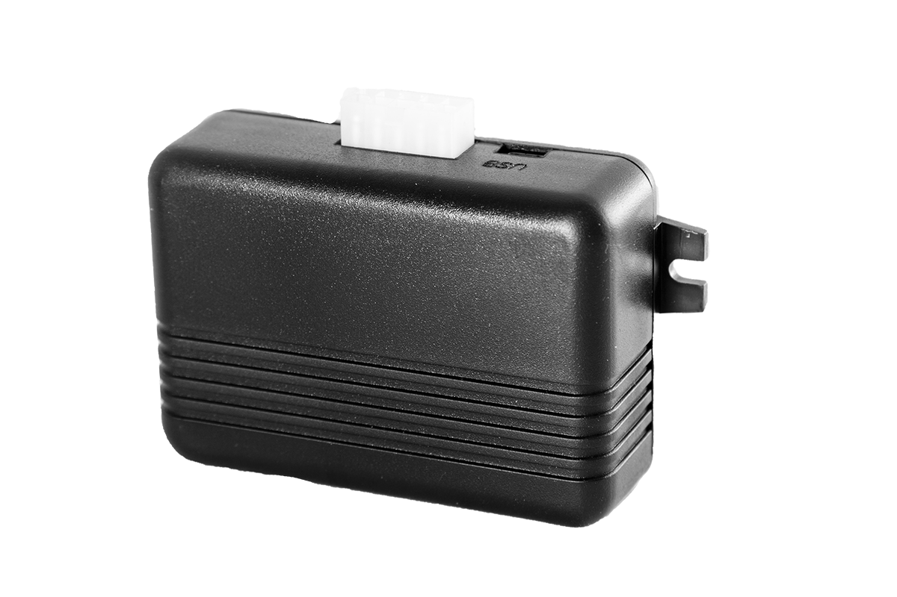

# Neomatica - ADM100

The Neomatica ADM100 is a compact GPS tracker engineered for dependable vehicle monitoring and straightforward mass deployment. It combines a high sensitivity GNSS receiver for accurate positioning with built in GSM connectivity to report location and event data in real time. The device is described as suitable for light commercial vehicles, trucks and special machinery, providing continuous position, speed and heading information along with local route storage.

As a Plaspy compatible device, the ADM100 can stream its telemetry to the Plaspy platform so fleets gain live maps, alerts and historical route analysis. Its on device route memory and flexible inputs make it a practical option for organizations that need reliable reporting during intermittent coverage and straightforward integration into Plaspy for operational oversight.

## Key Highlights

- Plaspy compatible GPS tracker designed for real time vehicle monitoring and fleet integration
- High sensitivity GNSS receiver for reliable position fixes in challenging reception areas
- Built in GSM GPRS connectivity for continuous data reporting and remote management
- Non volatile route storage holding up to 16,000 points to preserve data during outages
- Flexible I O including analogue and pulse inputs plus an RS 485 interface for external devices
- Wide operating voltage range for deployment across a variety of vehicle types and machinery

## How It Works with Plaspy

When connected to Plaspy, the ADM100 delivers position and event messages over GPRS so operators see live locations, receive alerts and review historical trips within the Plaspy interface. Plaspy ingests the device messages and presents them as map pins, event notifications and reports that support fleet oversight and operational decisions.

- Real time location and telemetry updates such as position speed and heading delivered to Plaspy
- Route history upload from device memory for playback and compliance reporting inside Plaspy
- Analogue and pulse inputs capture sensor events like fuel pulses or ignition changes for reporting
- Discrete input events provide alarm and anti theft notifications routed to Plaspy alerting rules
- RS 485 connection enables integration of additional telemetry sources to enrich platform data
- Remote firmware update capability reduces on site maintenance and keeps devices aligned with Plaspy requirements

## Typical Use Cases

- Fleet management with live tracking route replay and dispatch optimization
- Anti theft monitoring and recovery workflows using discrete input alerts and real time location
- Telemetry driven fuel and usage monitoring leveraging analogue and pulse inputs
- Tracking of special machinery and mobile equipment that require robust GNSS reception
- Operations with intermittent coverage that benefit from on device route storage and later upload

## Why Choose This Tracker with Plaspy

The ADM100 is a practical choice for organizations that need a compact, reliable tracker which integrates smoothly with Plaspy for live tracking, alerts and historical analysis. Its combination of strong GNSS performance, comprehensive I O options and onboard route memory supports a range of vehicle and equipment monitoring needs without unnecessary complexity.

If you want to learn more about how the ADM100 can work with Plaspy and whether it fits your deployment, visit https://www.plaspy.com. For accuracy and the latest product specifications including availability and manufacturer details verify current documentation on the official Neomatica site https://neomatica.com/ as specifications and support terms can change over time.
