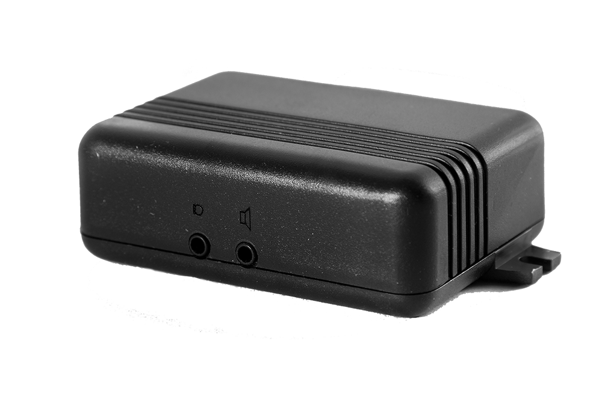

# Neomatica - ADM300

The ADM300 is a compact on board GPS GLONASS vehicle tracking terminal from Neomatica designed for continuous monitoring of cars trucks and special equipment. Intended for fleet management and telematics deployments the device provides real time position speed and heading updates stores extended route history on microSD and transmits telemetry and event data to a remote server for operational visibility.

As a Plaspy compatible device the ADM300 uses an open protocol and EGTS support to integrate directly into Plaspy based tracking platforms. That compatibility enables real time tracking alerts and historical reporting inside Plaspy while allowing remote device management and streamlined data flow from vehicles into your fleet operations dashboard.

## Key Highlights

- Plaspy compatible via EGTS and open protocol for straightforward integration into Plaspy based systems
- Real time GNSS tracking for reliable position speed and heading updates across vehicle types
- Long route history retention on microSD plus significant internal event logging for post incident review
- Built in backup battery and tamper detection to support anti theft monitoring and field resilience
- Multiple telemetry inputs and additional interfaces to capture sensor states and external device data
- Remote firmware updates and GPRS data transfer to simplify maintenance and keep deployments current

## How It Works with Plaspy

When paired with Plaspy the ADM300 forwards location telemetry event and input state data to your Plaspy server where that information is processed for live mapping alerts and historical reporting. Plaspy ingests the device messages and makes them available for monitoring fleet status creating alerts and generating operational reports.

- Live location and movement updates feed Plaspy maps and allow route playback for individual vehicles
- Event and input state messages are converted into rule based alerts inside Plaspy for driver and vehicle monitoring
- Stored route history from internal memory or microSD can be uploaded and reviewed in Plaspy for compliance and analysis
- Tamper and movement alerts from the accelerometer support anti theft workflows and timely notifications
- Remote firmware management over the air reduces the need for physical access while maintaining compatibility with Plaspy

## Typical Use Cases

- Fleet management for trucks delivery vehicles and service fleets requiring continuous visibility
- Anti theft monitoring and rapid response using tamper alerts movement detection and voice support
- Sensor telemetry for monitoring fuel door and other analog or pulse based inputs tied to operational rules
- Tracking special equipment such as construction or municipal machinery with large onboard logging needs
- Long route history retention for compliance post incident review and operational optimization

## Why Choose This Tracker with Plaspy

The ADM300 combines practical field oriented hardware with open protocol interoperability that makes it a sensible option for organizations deploying Plaspy for fleet tracking. Its focus on reliable GNSS reception extended logging and multiple telemetry inputs supports a range of operational requirements from routine route monitoring to anti theft workflows.

If your deployment prioritizes continuous visibility flexible telemetry and manageable device lifecycle operations the ADM300 is a viable candidate to pair with Plaspy. Its compatibility and feature set allow Plaspy to provide unified tracking alerts and historical analysis across mixed fleets without imposing unnecessary complexity.

To learn more about how Plaspy can work with devices like the ADM300 visit https://www.plaspy.com. Product specifications availability and manufacturer details can change over time so please verify current technical information on the official Neomatica site https://neomatica.com/.
