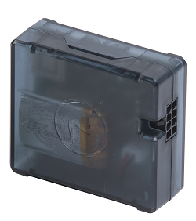

# Neomatica - ADM333

The Neomatica ADM333 v2 is an ultra compact GPS tracker designed for vehicles and stationary assets that require reliable real time tracking and telemetry. The 2021 revision modernizes the ADM333 line by combining core tracking functions with expanded sensor support, a small internal battery and multi network cellular connectivity to deliver continuous location updates and event detection for fleet and asset management.

As a Plaspy compatible device, the ADM333 v2 is suited for straightforward integration into telematics deployments. It uses an open protocol and GPRS telemetry to communicate with popular servers, which makes it easy to feed position, status and sensor data into Plaspy for monitoring, alerts and historical reporting. Its compact size and peripheral flexibility help preserve installation options while providing actionable data to the Plaspy platform.

## Key Highlights

- Plaspy compatible real time tracking via GPRS and open protocol for easy server integration.
- Ultra compact form factor with internal battery for short autonomous operation and built in antennas.
- Robust GNSS performance combined with movement detection and jamming alerts for improved asset security.
- Broad sensor support including Bluetooth Low Energy sensors, 1 wire probes and RS 485 interfaces for flexible telemetry.
- Dual SIM cellular modem and GPRS uplink for stable data transmission and remote updates.
- Low average power consumption and an onboard route buffer to retain telemetry during temporary connectivity loss.

## How It Works with Plaspy

The ADM333 v2 transmits GNSS position and peripheral telemetry over GPRS using an open protocol, allowing Plaspy to ingest location, status and sensor data in real time or via intermediary telematics servers. Integration supports continuous visibility, event driven alerts and historical route data that Plaspy can use for reporting, notifications and operational oversight.

- Real time location and telemetry updates suitable for live tracking and route playback.
- Ignition and analog input reporting to capture engine on off events and integrate with fleet workflows.
- Fuel monitoring support via wired or wireless sensors and RS 485 connected devices forwarded to Plaspy for consumption.
- Remote immobilizer control compatibility to support anti theft workflows and remote shutdown actions within Plaspy.
- Bluetooth sensor and beacon readings for temperature humidity tilt and other environmental telemetry sent to Plaspy.
- Event alerts such as accelerometer triggered movement, jamming detection and driver identification forwarded into Plaspy for automated responses.

## Typical Use Cases

- Fleet management for trucks delivery vans and passenger vehicles requiring ignition monitoring and route history.
- Anti theft and immobilization workflows using jamming detection and remote immobilizer control.
- Fuel monitoring and telemetry for commercial fleets using wired or wireless fuel sensors.
- Cold chain and environmental monitoring with BLE temperature probes or 1 wire sensors on trailers and stationary assets.
- Asset tracking for mixed fleets including agricultural machinery stationary equipment and auxiliary assets that need compact trackers.

## Why Choose This Tracker with Plaspy

The ADM333 v2 provides a compact and flexible option for organizations deploying Plaspy for vehicle and asset visibility. Its open protocol and GPRS uplink simplify integration into existing telematics architectures, while Bluetooth and RS 485 support expand the range of telemetry that can be forwarded to Plaspy for analysis and alerts. Built in battery backup, jamming detection and a substantial onboard route buffer help maintain data continuity during short power interruptions or temporary loss of cellular coverage.

If you want to learn more about Plaspy and how ADM333 deployments can be managed on the platform visit https://www.plaspy.com. Product specifications and availability can change over time, so please verify current technical details and compatibility on the manufacturer site https://neomatica.com/.
