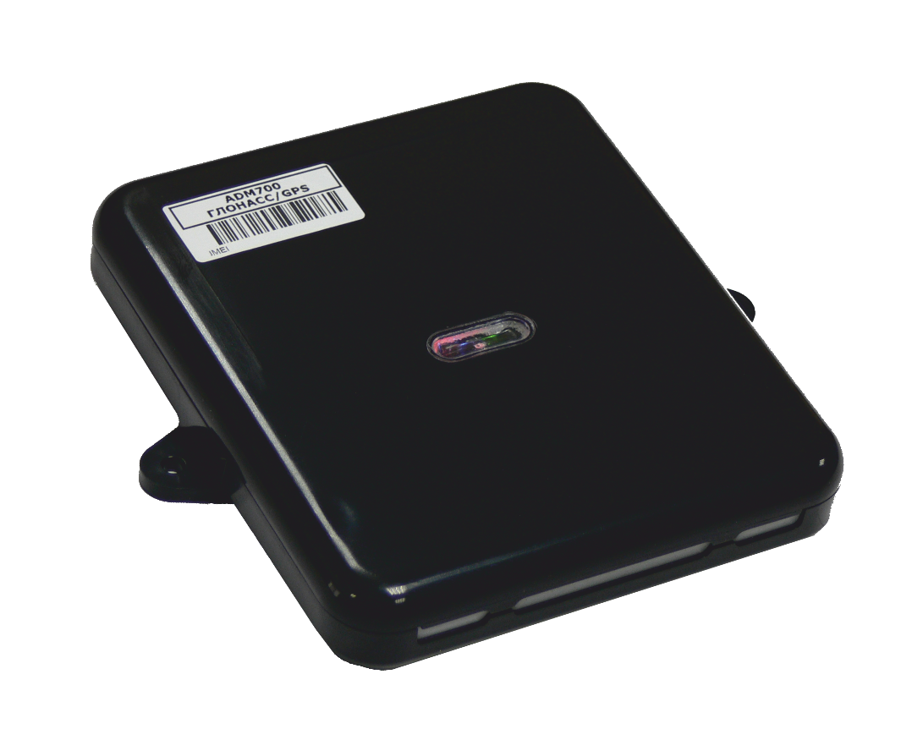

# Neomatica - ADM700 3G

The ADM700 3G from a reliable industrial telematics manufacturer is a Plaspy compatible GPS tracker engineered for demanding vehicle and special machinery deployments. With combined GPS/GLONASS positioning, 3G UMTS cellular connectivity, robust environmental protection \(IP65, IK07\) and wide voltage tolerance, the ADM700 3G delivers continuous real-time tracking and rich telemetry for fleet management, logistics and heavy equipment operations when integrated with Plaspy.

Designed for turnkey integration, the ADM700 3G supports EGTS and an open protocol, dual-SIM operation, voice channels and remote firmware updates over GPRS — features that simplify connection to Plaspy for live location, event-driven alerts and telematics reporting. Its high-sensitivity 132-channel GNSS receiver and extensive I/O make the ADM700 3G a durable choice for tracking, anti-theft monitoring and detailed telemetry collection in industrial environments.

## Key Highlights

- Plaspy compatible: open protocol and EGTS support allow straightforward integration for real-time tracking and fleet management.
- Robust positioning: GPS + GLONASS support with –165 dBm sensitivity and 132 channels for fast satellite acquisition and stable location fixes.
- Industrial durability: IP65 dust/water resistance, IK07 impact protection and surge protection up to +600 V for harsh vehicle and machinery environments.
- Comprehensive vehicle I/O: multiple analog/discrete inputs, pulse inputs, open-collector outputs and CAN \(FMS/J1939\) for telemetry and event capture.
- Reliable connectivity: GSM/UMTS 850/900/1800/1900/2100 bands with GPRS/EDGE/HSDPA data transmission and dual SIM for network redundancy.
- Power resilience: wide operating voltage \(+8.5…+48 V\) with short-term tolerance to +75 V and a 1000 mAh Li‑ion backup battery \(~6 hours\).
- High-capacity logging: up to 150,000 internal records and expandable storage via microSD \(up to ~8,000,000 records on 1 GB\) for offline logging.

## How It Works with Plaspy

When paired with Plaspy, the ADM700 3G sends secure telemetry and location data to the Plaspy platform over cellular networks \(GPRS/EDGE/HSDPA\). Plaspy ingests GNSS fixes, CAN bus telemetry \(FMS/J1939\), analog and discrete inputs, accelerometer events and time-stamped records from internal memory or microSD to provide live tracking, historical playback, alerts and reports tailored to fleet management and anti-theft workflows.

- Real-time location and telemetry updates sent to Plaspy via GPRS/EDGE/HSDPA; domain name addressing is supported for flexible server routing.
- Vehicle status and sensor readings captured from analog/discrete inputs and CAN \(FMS/J1939\) are available to Plaspy for diagnostics and reporting.
- Event logging and offline records: recorded data stored internally \(up to 150,000 records\) or on microSD is uploaded to Plaspy when connectivity resumes.
- Accelerometer and built-in temperature sensor data provide motion and environment context for Plaspy alerts \(impact, harsh braking, temperature thresholds\).
- Remote firmware updates over GPRS enable fleet-wide maintenance and configuration management through manufacturer procedures, simplifying Plaspy deployments.

## Technical Overview

| Connectivity | GSM/UMTS with GPRS/EDGE/HSDPA data transmission |
| --- | --- |
| Bands | GSM/UMTS 850 / 900 / 1800 / 1900 / 2100 \(3G UMTS support for ADM700 3G\) |
| Power & Battery | Operating voltage +8.5…+48 V \(short-term up to +75 V\); surge protection up to +600 V; Li‑ion backup battery 1000 mAh \(~6 hours\) |
| Interfaces | 6 analog/discrete inputs; 2 pulse/discrete inputs; 4 open-collector outputs; RS-485; RS-232; CAN \(FMS, J1939\); 1-Wire bus for up to 8 temperature sensors |
| GNSS | GPS + GLONASS support; high-sensitivity receiver –165 dBm; 132 channels |
| Bluetooth | Not included in ADM700 3G \(use Plaspy-compatible BLE gateways if Bluetooth sensor integration is required\) |
| Remote Management | Remote firmware updates over GPRS; manufacturer documentation and firmware available via support |
| Memory & Logging | Internal non-volatile logging up to 150,000 records; microSD support \(1 GB example holds up to ~8,000,000 records\) |
| Form Factor & Protection | Rugged vehicle/industrial enclosure; IP65 dust/water resistance; IK07 impact protection; integrated GPS/GLONASS and GSM antennas |

## Use Cases

- Fleet management: continuous real-time tracking, route playback, CAN-derived vehicle telemetry and driver behavior analysis via Plaspy dashboards.
- Logistics and asset tracking: reliable position and event logging for trailers, containers and mixed fleets with offline record buffering.
- Heavy equipment monitoring: rugged IP65/IK07 design and wide voltage range allow the ADM700 3G to capture telemetry on construction and agricultural machinery.
- Anti-theft & security workflows: geofence alerts, accelerometer events and remote control integration through outputs combined with Plaspy alerting.
- Temperature and sensor monitoring: 1-Wire bus support for up to eight temperature sensors for refrigerated loads or environment-sensitive cargo.

## Why Choose This Tracker with Plaspy

Choosing the ADM700 3G for Plaspy integration delivers a balance of rugged hardware, comprehensive I/O and proven connectivity to support scalable fleet management and telemetry. Its support for EGTS and open protocol simplifies server-side integration, while dual SIM and voice channels improve uptime and operational flexibility. Remote firmware updates and manufacturer support help keep devices current across large deployments.

For operations that require anti-theft measures, immobilizer workflows can be implemented within Plaspy using the device’s configurable outputs and event logic when integrated with appropriate control hardware. For customers needing Bluetooth sensor integration, Plaspy can extend telemetry by pairing ADM700 3G units with compatible BLE gateways. Overall, the ADM700 3G is a rugged, telematics-ready tracker designed to provide reliable real-time tracking, telemetry, fuel/engine data via CAN, and resilient logging — all essential elements for modern fleet management on the Plaspy platform.

