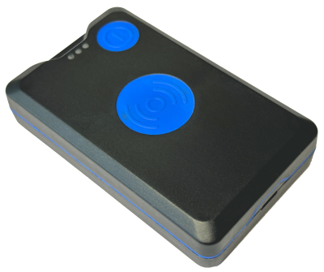

# Neomatica - ADM P50

The Neomatica ADM P50 is a compact, battery-powered GPS tracker designed for reliable personal and asset tracking and fully Plaspy compatible for immediate integration. Built around a GPS/GLONASS MT3333 chipset and an energy-optimized firmware, the ADM P50 delivers flexible operation modes—from real-time tracking to a low-frequency beacon mode—so you can balance continuous positioning and long-term autonomy on the Plaspy platform.

The ADM P50 is ideal when you need accurate location, motion-aware telemetry, and emergency alerts without constant mains power. With a 3350 mAh rechargeable Li-Po battery, USB Type-C configuration, a panic \(SOS\) button, 3-axis accelerometer, LBS fallback and support for an ADM34 Bluetooth tag for indoor positioning, this GPS tracker adds personal-safety and asset-protection capabilities to Plaspy dashboards, alerts, and reporting.

## Key Highlights

- Plaspy compatible GPS tracker — native support for integration with Plaspy for real-time tracking and historical route playback.
- Long battery autonomy — 3350 mAh Li‑Po and energy-saving firmware offers modes from continuous tracking to beacon mode for extended runtime.
- Emergency and motion alerts — dedicated SOS/panic button plus a 3-axis accelerometer for motion detection and sleep activation.
- Indoor positioning support — pairs with the ADM34 Bluetooth tag to enhance indoor navigation and location accuracy inside buildings.
- Dual SIM flexibility — single physical SIM plus an embedded SIM chip for flexible cellular connectivity arrangements.
- Robust logging — route record capacity up to 100,000 points for detailed historical tracks and offline review.
- Easy setup and updates — USB Type-C configuration and manufacturer-provided firmware updates and documentation.

## How It Works with Plaspy

When connected to Plaspy, the ADM P50 streams position and event data in the formats Plaspy accepts so you get real-time tracking, alerts, and telemetry on the same platform used for fleet management and asset monitoring. Plaspy ingests location fixes from GNSS, LBS fallback points, motion states from the accelerometer, and discrete event messages such as SOS alerts and low battery notifications.

- Real-time location and telemetry updates: GNSS coordinates \(GPS/GLONASS\) and periodic route uploads for map visualization and tracking.
- SOS / panic alerts: immediate event notifications from the panic button routed to Plaspy alarm channels.
- Motion and sleep events: accelerometer-driven motion detection and low-power sleep transitions reported as telemetry.
- Battery and low-battery notifications: battery level telemetry and SMS alarm options for operational visibility.
- Indoor positioning signals: Bluetooth tag \(ADM34\) events for indoor navigation and proximity-based location inside buildings.

## Technical Overview

| GNSS chipset | MT3333 \(GPS / GLONASS\) |
| --- | --- |
| Connectivity | GSM / GPRS \(GPRS Multi-slot Class 12\) |
| Bands | GSM 850 / 900 / 1800 / 1900 |
| GSM transmitter power | 2 W |
| SIM | 1 physical SIM + embedded SIM chip |
| Communication & configuration | USB Type-C for PC connection and configuration |
| Battery | Li‑Po 3350 mAh \(rechargeable\) |
| Charger input | 5 V |
| Accelerometer | 3-axis \(motion detection, sleep activation\) |
| Panic button | Yes \(SOS\) |
| Route record capacity | Up to 100,000 points |
| Bluetooth | Supports pairing with ADM34 Bluetooth tag for indoor positioning |
| Remote management | Firmware updates and user manual provided by manufacturer \(Neomatica\) |
| Operating temperature | Discharge: -20 to +60 °C; Charge: 0 to +45 °C |
| Dimensions & weight | 88 × 56 × 25 mm; 120 g |

## Use Cases

- Personal safety and lone-worker protection — SOS alerts, motion monitoring and Plaspy-based alarm routing for rapid response.
- Employee and event monitoring — track staff movement and positions during outdoor events or sport monitoring with real-time telemetry.
- Cargo protection and anti-theft monitoring — portable tracking and route history for high-value shipments and on-the-move assets.
- Indoor navigation and access control — pair with ADM34 Bluetooth tags for room-level positioning and restricted-area monitoring.
- Animal and wildlife tracking — compact, lightweight form factor for mobile object monitoring where long battery life is required.

## Why Choose This Tracker with Plaspy

The ADM P50 is a practical Plaspy compatible GPS tracker when you need a balance of accurate location, extended battery life, and compact portability. Its combination of GNSS positioning, LBS fallback, accelerometer-driven power management and SOS capability gives teams the telemetry they need for safety and anti-theft workflows without the power demands of vehicle telematics. The device’s SIM flexibility and USB Type‑C configuration make deployment and maintenance straightforward, while manufacturer firmware updates and documentation ensure ongoing reliability.

While the ADM P50 is optimized for personal and asset monitoring rather than vehicle-focused features like ignition control, immobilizer, or fuel monitoring, it integrates smoothly into Plaspy environments used for fleet management and broader situational awareness. Use ADM P50 with Plaspy to add portable, battery-powered tracking to your telemetry suite—supported by indoor Bluetooth sensors, route history, and immediate alerting for safety and security operations.

