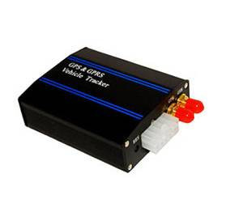

# Noran - NR008

The NR008 is a robust automobile GPS tracker designed for Plaspy compatible deployments that need reliable real-time tracking and vehicle control. Built around a SiRFstar GNSS chipset and SIMCOM GSM/GPRS communications, the NR008 delivers continuous position updates, real-time alerts and remote control functions that integrate smoothly into Plaspy-based fleet management and telematics workflows.

The NR008 is ideal for businesses and individuals requiring anti-theft protection, remote immobilization and in-vehicle voice monitoring. With SOS alerts, geo-fencing, over-speed alarms and movement detection, this GPS tracker provides the telemetry and control features fleet managers expect while remaining straightforward to integrate with Plaspy via SMS or GPRS.

## Key Highlights

- Plaspy compatible GPS tracker for reliable real-time tracking and fleet management.
- Remote immobilizer and engine control \(fuel shutoff via SMS/GPRS\) for anti-theft response.
- SOS emergency alerts and voice monitoring—authorized numbers can call the device to listen inside the vehicle.
- Geo-fencing and movement alerts to detect unauthorized routes or tampering, including anti-dismantle alarm on power loss.
- Over-speed alarms sent to the server and authorized mobile numbers to enforce safety and compliance.
- Packaged with practical accessories \(SOS button, microphone, GPS antenna, connection cable\) for fast in-vehicle installation.
- SiRFstar GPS and SIMCOM GSM module combination provides dependable GNSS fixes and cellular connectivity for telemetry delivery.

## How It Works with Plaspy

When integrated with Plaspy, the NR008 transmits location and event data to the Plaspy platform over GSM/GPRS or via SMS. Plaspy ingests that data to provide map-based real-time tracking, alerting, and historical reports. Fleet managers can issue remote commands \(for example, to immobilize a vehicle\) through Plaspy using SMS or GPRS command channels supported by the NR008.

- Real-time location and telemetry updates delivered to Plaspy via GPRS or SMS.
- Geo-fence boundary alerts and movement detection trigger immediate notifications in Plaspy.
- SOS emergency alerts forwarded to Plaspy and authorized contacts for rapid response.
- Remote immobilizer/engine control through Plaspy-issued SMS/GPRS commands to perform fuel shutoff when supported by vehicle wiring.
- Voice monitoring \(call-in listening\) and anti-dismantle alarm notifications are relayed to Plaspy-enabled alert channels.
- Plaspy can also coordinate telemetry and reporting workflows alongside other peripherals; if your deployment uses Bluetooth sensors, Plaspy can aggregate those readings alongside NR008 data when paired with compatible hardware.

## Technical Overview

| Connectivity | GSM/GPRS \(SIMCOM module\); SMS and GPRS data channels for telemetry and remote control |
| --- | --- |
| Bands | 850 / 900 / 1800 / 1900 MHz and 2100 MHz \(3G\) |
| Power & Battery | Operates from vehicle power; anti-dismantle alarm triggers on vehicle power loss \(backup battery not specified\) |
| Interfaces | SOS external button input; microphone for voice monitoring; connection cable for vehicle wiring; remote engine control \(fuel shutoff via SMS/GPRS\); compatible with original car anti-theft assistant alarm |
| GNSS | SiRFstar chipset, 20 channels; GPS capture time \(average\) 0.1 s; Hot start ≈ 2 s; Warm start ≈ 38 s; Cold start ≈ 44 s; Height limit 18,000 m; Speed limit 515 m/s |
| Bluetooth | Not specified in manufacturer data |
| Remote Management | Remote commands and configuration via SMS/GPRS; server-based telemetry collection compatible with fleet management platforms like Plaspy |
| Form Factor | In-vehicle tracker—shipped with SOS button, microphone, GPS antenna, connection cable and English user manual; packaged as gift or compressed kit options |
| RF Performance | Maximum RF output 33.0 dBm ±2 dBm; Dynamic input range -15 to -102 dBm; Frequency stability &gt;2.5 ppm |

## Use Cases

- Fleet management: real-time tracking, over-speed alerts and route monitoring to improve utilization and driver safety.
- Anti-theft and remote immobilization: detect theft events, receive anti-dismantle alarms and perform remote fuel shutoff when needed.
- Vehicle rental and shared mobility: SOS alerts, geo-fencing and movement detection keep rented assets secure and trackable.
- Driver safety and incident response: voice monitoring and SOS button provide emergency communications and faster assistance.
- General telematics and reporting: collect location-based telemetry for maintenance scheduling, compliance reporting and operational optimization.

## Why Choose This Tracker with Plaspy

The NR008 pairs proven GNSS accuracy from a SiRFstar chipset with mature SIMCOM cellular communications to deliver dependable GPS tracker performance for Plaspy compatible deployments. Its combination of remote immobilizer capability, SOS and voice monitoring, geo-fencing and over-speed alarms gives fleet operators the control and situational awareness required for modern fleet management and anti-theft strategies.

Deploying the NR008 with Plaspy enables fast integration via SMS/GPRS, straightforward alert routing and centralized telemetry reporting. For organizations focused on reliability and practical vehicle control—rather than experimental features—the NR008 is a purpose-built option that supports scaled fleet management, telemetry workflows and safety-focused monitoring while being shipped with the accessories needed for rapid installation.

