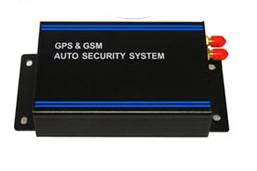

# Noran - NR016

The Car Alarm GPS Tracker NR016 from an established hardware family delivers Plaspy compatible, vehicle-focused tracking and anti-theft protection for cars, taxis, buses and commercial fleets. Combining GPS satellite positioning with GSM/GPRS communications and 3G support, the NR016 provides reliable real-time tracking, SOS alerts, remote immobilization and multi-input telemetry that integrate smoothly into the Plaspy platform for centralized fleet management and security monitoring.

Designed for installers and fleet operators who need robust anti-theft functionality and practical telematics, the NR016 supports ACC, doors, trunk and bonnet status inputs, vibration/shock detection and remote voice monitoring. When paired with Plaspy, the NR016 feeds live position, alarm events and sensor telemetry into dashboards, alerts and reports that help recover stolen vehicles, reduce downtime and improve operational visibility.

## Key Highlights

- Plaspy compatible real-time tracking via GPS and mobile base-station hybrid locating for consistent position updates.
- Vehicle anti-theft features: SOS alarm, overspeed alarm, geo-fencing and immediate alerts to designated numbers or platforms.
- Remote immobilizer and cut-off capability to disable fuel or power remotely for theft recovery and fleet control.
- Comprehensive I/O: 10 digital/analog inputs and outputs for ACC, door/trunk/bonnet monitoring, relays and external sensors.
- Built-in vibration sensor and external vibration accessory for tamper and shock detection.
- Backup battery \(~400 mAh\) to maintain operation and send alarms if vehicle power is removed.
- Included accessories \(microphone, SOS button, relay, antennas\) streamline installation and voice monitoring setup.

## How It Works with Plaspy

When installed in a vehicle, the NR016 streams location and event data over GSM/GPRS \(and 3G where available\) to Plaspy servers. Plaspy ingests GPS coordinates, hybrid LBS data, and digital/analog telemetry from the device to deliver live maps, alerts and historical reports. Administrators can configure geofences, overspeed thresholds, and alarm recipients within Plaspy so you get timely notifications and actionable insights.

- Real-time location and telemetry updates \(GPS + mobile base-station hybrid locating\) to Plaspy dashboards and alerts.
- Ignition \(ACC\), door, trunk and bonnet status reporting for accurate trip and security event logging.
- Fuel and power control capability via relay outputs and analog inputs — supports remote cut-off for immobilization.
- Remote voice monitoring \(listen-in\) and SOS button alerts forwarded to Plaspy for rapid incident response.
- Vibration/shock detection and low-battery warnings sent as alarms to Plaspy for tamper detection and maintenance planning.

## Technical Overview

| Model | NR016 \(Car Alarm GPS Tracker\) |
| --- | --- |
| Connectivity | GSM/GPRS \(SIMCOM900D\), GPS satellite positioning; supports internet or SMS reporting |
| Bands | 850 / 900 / 1800 / 1900 MHz \(GSM\) and 2100 MHz \(3G support\) |
| GNSS | GPS chipset: SIRF3; supports GPS positioning and mobile base-station hybrid locating |
| Power & Battery | Operating voltage DC 6.3V–40V; working current 60–150 mA; built-in backup battery ≈ 400 mAh |
| Operating Conditions | Temperature -40°C to 85°C; Humidity 10%–90% |
| Interfaces | 10 digital/analog I/O for sensors, ignition input, relays and external peripherals; includes relay |
| Alarms & Sensors | SOS alarm, overspeed, geo-fencing, low-battery warning, vibration/shock detection, microphone for voice monitoring |
| Accessories Included | GPS antenna, GSM antenna, microphone, SOS button, alarm horn, relay, connecting cables, vibration sensor |
| Form Factor | Approx. 131 × 75 × 30 mm — compact vehicle installation |
| Bluetooth | No Bluetooth module specified \(platform-level Bluetooth sensors can be combined with Plaspy separately\) |
| Remote Management | Remote commands and alarms via SMS/internet; remote cut-off of fuel or power; remote voice monitoring |

## Use Cases

- Fleet management: continuous real-time tracking, route history and overspeed alerts for taxis, shuttle buses and delivery fleets.
- Vehicle anti-theft: integrate with factory alarm systems, trigger SOS alerts, and remotely immobilize vehicles to aid recovery.
- Telematics & driver behavior: monitor ignition cycles, speed events and door/trunk activity for safety and compliance reporting.
- Remote monitoring for high-value assets: vibration detection and geo-fencing alert operators to unauthorized movement.
- Integrated emergency response: SOS button and voice monitoring enable rapid incident verification and notification via Plaspy.

## Why Choose This Tracker with Plaspy

Choosing the NR016 as a Plaspy compatible GPS tracker gives fleet managers and security teams a rugged, vehicle-tailored option that balances anti-theft controls with telematics data needed for efficient fleet management. Its multi-input I/O, relay outputs for immobilization, and built-in vibration sensor make it practical for installations that require ACC, door and trunk monitoring plus direct vehicle control. Plaspy turns the NR016’s raw location and alarm signals into real-time maps, configurable alerts and historical reports — enabling faster recovery, fewer false alarms and clearer operational intelligence.

Because the NR016 supports hybrid locating, multiple alarm types and standard GSM/3G connectivity, it integrates easily into existing Plaspy workflows without complicated modifications. Use it to enforce route compliance, monitor ignition and telemetry, and combine device feeds with platform-level tools such as Bluetooth sensors or fuel-monitoring inputs to build a complete telematics solution tailored to your fleet’s needs.

