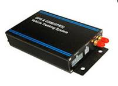

# Noran - NR028

The NR028 is a vehicle mounted navigation and telematics unit from Noran that combines GPS positioning with an integrated touchscreen display and an embedded digital camera. Designed for fleet management, vehicle security and in cab navigation, the NR028 delivers live location, driver communication and multimedia navigation in a single device suitable for dispatch operations and incident documentation.

As a device that is Plaspy compatible out of the box, the NR028 can forward real time location, alarms and sensor events into Plaspy for centralized monitoring and reporting. Its combination of live tracking, two way voice and messaging, remote immobilizer functions and onboard storage make it a practical choice for operators who want an integrated tracker that feeds Plaspy dashboards, alerts and historical playback.

## Key Highlights

- Plaspy compatible vehicle mounted tracker that supports live location and telemetry for fleet oversight and anti theft workflows
- Integrated 4.3 or 7 inch touchscreen and built in digital camera for navigation, incident capture and driver communication
- Real time tracking via Internet and SMS with location fallback options to maintain updates in variable coverage
- Remote immobilizer support including engine cut off and voice monitoring to assist vehicle security and incident response
- Advanced alarms such as overspeed, geo fence breaches, SOS emergency and power cut off with internal backup support
- Fuel monitoring support for up to two external fuel sensors and logging for consumption analysis and theft detection
- Compact telemetry and onboard flash logging to reduce data usage while retaining key events for later review

## How It Works with Plaspy

When connected to Plaspy the NR028 sends position updates, alarm states and configured sensor data to the platform where those inputs are turned into actionable events, notifications and reports. Plaspy receives the incoming telemetry and presents it on dashboards, in historical playback and through automated alerts so operations teams can monitor vehicles at scale.

- Real time location and telemetry updates delivered to Plaspy via Internet or SMS transport methods
- Alarm and status events such as overspeed, geo fence breach, SOS emergency and power cut off surfaced in Plaspy for alerting
- Fuel sensor readings and related telemetry reported to Plaspy to support consumption reporting and anti theft alerts
- Remote immobilizer and engine cut off commands can be issued from Plaspy to the NR028 to aid recovery workflows
- Driver communication and two way voice or text messaging events are recorded as telematics activity and can be associated with incidents
- Camera and event metadata from the unit can be linked to incident records for post event review in Plaspy

## Typical Use Cases

- Fleet management and dispatch where in cab navigation, driver communication and live tracking improve routing and service levels
- Vehicle security and anti theft operations using remote immobilizer, SOS alarms and voice monitoring to respond to incidents
- Fuel monitoring and telemetry programs that detect irregular consumption and support refueling optimization
- Incident documentation and driver coaching using embedded camera captures and logged event history
- Remote monitoring of high value or sensitive assets that benefit from combined navigation, camera and alarm capabilities

## Why Choose This Tracker with Plaspy

The NR028 is suited to organizations that prefer an integrated in vehicle solution combining navigation, camera and robust telemetry. Paired with Plaspy, the unit becomes part of a centralized monitoring and reporting workflow that turns device events into operational insights and timely alerts. Plaspy organizes incoming GPS, alarm and sensor data into dashboards and reports that suit both small fleets and larger operations.

Because the NR028 already ships with features for dispatch, security and fuel monitoring, it can reduce the number of separate devices required in a vehicle and simplify data aggregation within Plaspy. If you need consolidated visibility, automated alerts and historical playback for driver events and incidents, the NR028 working with Plaspy provides a practical, low friction approach.

Learn more about Plaspy and how compatible trackers are supported at https://www.plaspy.com. Product specifications, availability and manufacturer details can change over time, so please verify current technical information on the official Noran site http://www.norantracker.com/ before making purchasing decisions.
