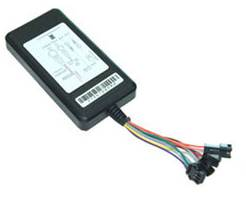

# Noran - NR108

The NR108 is a compact GPS tracker designed for discreet installation on motorcycles and other small vehicles. It combines integrated GPS and GSM antennas in a small housing to provide accurate positioning, fuel monitoring, and anti theft features in a low profile package. The device supports reporting via Internet and SMS with LBS fallback for areas of limited GPS reception, and includes a built in backup battery and power saving sleep mode to maintain visibility during power interruptions.

As a Plaspy compatible device, the NR108 can feed vehicle location, fuel telemetry, and alarm events into Plaspy’s tracking and fleet management platform. Its small form factor and low data transmission design make it a practical choice for businesses using Plaspy who need discreet hardware, continuous monitoring, and fuel reporting for small fleets or individual vehicles.

## Key Highlights

- Compatible with Plaspy for real time dashboards, alerts, and historical reporting.
- Compact housing suitable for concealed installation on motorcycles and light vehicles.
- Location reporting via Internet and SMS with LBS fallback when GPS is limited.
- Fuel monitoring and consumption reporting to support operational cost control.
- Anti theft functions including SOS alarm, geo fence, overspeed alarm, and relay based immobilizer.
- Built in backup battery and power cut reporting to preserve tracking during interruptions.

## How It Works with Plaspy

When paired with Plaspy, the NR108 delivers continuous location and status updates that integrate into Plaspy’s tracking engine, alerting system, and reporting tools. The device’s low data packet approach and optional internal logging help maintain historical position records and reduce connectivity costs while ensuring important events are surfaced to operators.

- Send real time location updates and telemetry to Plaspy for live map visibility.
- Surface fuel level and fuel consumption data in Plaspy reports for cost monitoring.
- Trigger Plaspy alerts from overspeed, geo fence breaches, SOS events, and power cut notifications.
- Use immobilizer relay controls and authorized remote commands through Plaspy when configured.
- Upload logged positions stored locally to Plaspy when network service is restored.

## Typical Use Cases

- Motorcycle tracking and anti theft protection where discreet mounting is required.
- Small vehicle fleets that need fuel monitoring and consumption reporting for cost control.
- Service and delivery operations needing compact trackers with low data usage.
- Asset continuity tracking for vehicles subject to power interruptions.
- Safety and compliance workflows using overspeed and geo fence alerts.

## Why Choose This Tracker with Plaspy

The NR108 pairs a focused feature set with a small footprint, making it well suited to organizations that require discreet hardware, reliable location reporting, and fuel telemetry. Its design emphasizes continued visibility during outages and lower connectivity overhead, which complements Plaspy’s strengths in real time monitoring, alerts, and fleet reporting.

If you want to learn more about how Plaspy can work with devices like the Noran NR108, visit https://www.plaspy.com. Product specifications and availability can change over time, so please verify current details on the manufacturer site at http://www.norantracker.com/ before making procurement or deployment decisions.
