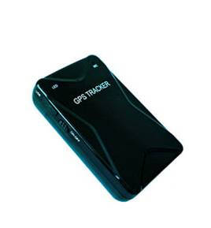

# Noran - NR200

The NR200 Magnetic Wireless GPS Tracker is a compact, battery-powered GPS tracker designed for covert long-term vehicle and asset tracking and is Plaspy compatible for seamless integration into modern fleet and asset management workflows. Its strong magnetic mount and wireless installation make the NR200 ideal when you need real-time tracking without tampering with vehicle wiring—perfect for temporary installs, recovery operations, and hard-to-access assets.

The device pairs with Plaspy to deliver reliable real-time tracking, route history, and alarm telemetry over SMS, web platform, and Android app interfaces. With a 5000mAh battery and configurable sleep modes providing up to 30 days standby, the NR200 balances long battery life and compact form factor for discreet anti-theft monitoring, equipment oversight, and trailer/container tracking.

## Key Highlights

- Plaspy compatible for fast integration into web and mobile fleet management dashboards and third-party servers via standard TCP/UDP/HTTP protocols.
- Magnetic, fully wireless installation—attach to metal surfaces for covert deployment without vehicle wiring or tools.
- Up to 30 days standby on a 5000mAh battery with configurable sleep mode for extended deployments and low-maintenance monitoring.
- Real-time tracking and double-positioning \(GPS + A-GPS/LBS\) to improve location reliability in weak-signal environments.
- Comprehensive alerts and telemetry: geo-fence alarms, overspeed alerts, mileage statistics, and history route playback \(up to 90 days\).
- Audio monitoring via remote call-in for on-demand listening—useful for situational awareness during recovery or investigation.
- Compact, lightweight form \(95 x 60 x 25 mm; 125 g\) that fits discreetly on trailers, containers, equipment, and many vehicle types.

## How It Works with Plaspy

Integration with Plaspy is straightforward: the NR200 transmits position and telemetry over cellular networks using standard TCP/UDP/HTTP protocols, and can also provide SMS-based updates where needed. Plaspy ingests the device data to deliver real-time tracking, alerts, and historical reporting in the same dashboard used for other fleet assets. Because the NR200 supports double-positioning \(GPS + A-GPS/LBS\), Plaspy can present consistent location fixes even in urban or weak-satellite areas.

- Real-time location and telemetry updates via TCP/UDP/HTTP and SMS to Plaspy and third-party servers.
- Geo-fence alarms and overspeed alerts forwarded to Plaspy for instant operator notification.
- History route playback \(up to 90 days\) and mileage statistics viewable inside the Plaspy platform.
- Audio monitoring accessible through the device’s remote call feature for on-demand listening tied to Plaspy event workflows.
- Plaspy can correlate NR200 position and telemetry with other fleet telemetry—such as fuel monitoring, ignition state, or immobilizer controls—when those signals are available in a broader telematics setup.

## Technical Overview

| Model | NR200 Magnetic Wireless GPS Tracker |
| --- | --- |
| Connectivity | GSM/GPRS \(cellular\) and 3G support |
| Bands | GSM/GPRS 850 / 900 / 1800 / 1900 MHz; 2100 MHz \(3G\) |
| GNSS | GPS module: SiRFstar IV; sensitivity down to -159 dBm; typical GPS positioning accuracy ~10 m; GSM/LBS accuracy 50–200 m |
| Battery | 5000 mAh rechargeable battery; up to 30 days standby \(configurable sleep modes\) |
| Power / Voltage | Operating voltage 9–36 V |
| Performance | Cold start &lt; 38 s; Warm start &lt; 32 s; Hot start &lt; 2 s; Altitude limit 18,000 m; Velocity limit 515 m/s |
| Current Draw | Typical ~60 mA \(12 V DC\) or ~35 mA \(24 V DC\); standby &lt; 50 mA |
| Environmental | Operating temperature -20°C to 70°C; Humidity 20%–80% RH |
| Communications Protocols | TCP, UDP, HTTP; SMS support for alerts and reporting |
| Form Factor | 95 x 60 x 25 mm; weight 125 g; magnetic rear cover for attachment |
| Included Accessories | 5000 mAh battery, magnetic cover, adapter, charging cable, user manual |

## Use Cases

- Covert vehicle recovery and anti-theft monitoring where a magnetic, non-invasive installation reduces detection risk.
- Tracking trailers and shipping containers during transit or in storage, with long battery life for extended journeys.
- Equipment and asset management on job sites where external power is not available—monitor location and usage patterns remotely.
- Fleet oversight for temporary or short-term deployments that require quick installation and Plaspy-compatible real-time tracking.
- Situational monitoring that benefits from audio monitoring and history route playback during investigations or incident reviews.

## Why Choose This Tracker with Plaspy

Pairing the NR200 with Plaspy delivers a practical, low-touch tracking solution that emphasizes reliability, discretion, and long battery life. The combination suits fleet management and anti-theft workflows where non-invasive installation, extended standby, and Plaspy-compatible real-time tracking are priorities. Because the NR200 uses standard TCP/UDP/HTTP and SMS protocols, integration is flexible: use the vendor’s web and Android app or ingest device data directly into Plaspy or other third-party platforms for consolidated telemetry.

Operators gain the benefits of GPS tracker location accuracy, double-positioning \(GPS + A-GPS/LBS\) for improved coverage, route history for operational analysis, and instant alerts for geo-fence and overspeed events. While the NR200 focuses on discreet, battery-powered deployment, Plaspy’s platform can augment its location and telemetry with broader fleet signals—such as fuel monitoring or ignition/immobilizer data—when those inputs are present in a unified telematics stack. This makes the NR200 a dependable element in mixed-technology deployments where real-time tracking, anti-theft response, and long-term monitoring are essential.

