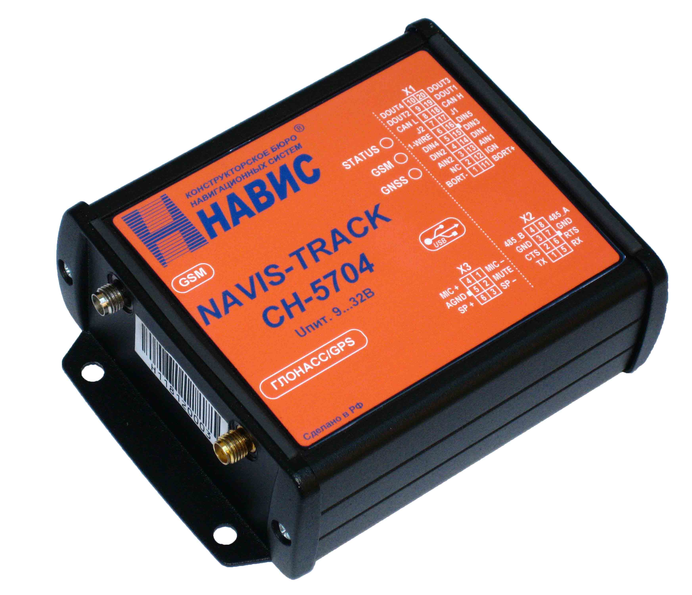

# NVS - CH-5704

The NVS CH-5704 is an automobile terminal manufactured by ZAO KB NAVIS, designed for vehicle monitoring and protection applications. It uses signals from multiple satellite navigation systems including GLONASS, GPS, GALILEO, and SBAS to provide accurate positioning, and relies on GSM data transmission for sending location and status information. The terminal is built on the NV08C navigation receiver and is positioned as a high quality solution for onboard tracking.

As a Plaspy compatible device, the CH-5704 can be integrated into Plaspy's fleet management workflows thanks to its open protocol of information exchange and standard data transmission channel. This combination of multi GNSS positioning and GSM connectivity makes the CH-5704 a practical option for organizations that want continuous vehicle visibility and centralized monitoring through the Plaspy platform.

## Key Highlights

- Multi GNSS reception with GLONASS, GPS, GALILEO, and SBAS for improved position accuracy
- GSM data transmission for real time communication and remote monitoring
- Purpose built for vehicle monitoring and protection systems
- Based on the NV08C navigation receiver, reflecting established navigation technology
- Open protocol of information exchange for easier integration with third party platforms
- Suited for deployment in fleet and asset tracking environments

## How It Works with Plaspy

When used with Plaspy, the CH-5704 sends positional data and status messages over GSM using its open information exchange protocol, allowing Plaspy to interpret and display vehicle locations and movement history. Plaspy ingests these inputs to provide visibility, alerts, and operational reporting for fleet managers.

- Live vehicle location and movement displayed on Plaspy maps
- Event and status notifications routed into Plaspy for alerting and oversight
- Historical route data captured for reporting and operational analysis
- Centralized fleet views for monitoring multiple CH-5704 units at once
- Integration into existing monitoring setups using the terminal's open protocol

## Typical Use Cases

- Fleet vehicle tracking for logistics and transport companies
- Vehicle security and protection systems requiring continuous location reporting
- Centralized monitoring of mixed fleets through Plaspy dashboards
- Route logging and post trip analysis for operations and compliance
- Integration into enterprise monitoring systems that require open protocol devices

## Why Choose This Tracker with Plaspy

The CH-5704 is a practical choice for organizations that require a vehicle terminal with multi satellite system support and reliable GSM communication. Its foundation on the NV08C receiver and an open information exchange protocol make it adaptable to different monitoring environments, and its design focus on vehicle protection aligns with common fleet management needs.

Paired with Plaspy, the CH-5704 can deliver consistent location visibility and support standard fleet workflows without extensive customization. For teams looking for a straightforward device to feed location and event information into Plaspy, the CH-5704 offers a balance of proven navigation technology and interoperability.

If you want to learn more about how Plaspy works with devices like the NVS CH-5704, visit https://www.plaspy.com. Product specifications and availability can change over time, so please verify current technical details and manufacturer documentation at https://www.nvs-ts.ru/.
