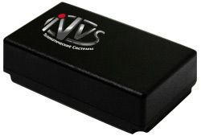

# NVS - Navitrek UM-02

The Navitrek UM-02 is an autonomous search device designed to locate objects and transmit the information via GPRS/SMS channels to a control center. This compact device is perfect for tracking and monitoring assets, vehicles, or even individuals. With its advanced technology and reliable performance, the Navitrek UM-02 is an excellent choice for businesses and individuals looking for a reliable GPS tracker.

One of the standout features of the Navitrek UM-02 is its use of the domestic certified GLONASS/GPS receiver series NV08C manufactured by ZAO KB NAVIS. This receiver provides the user with a number of additional advantages, including enhanced accuracy and reliability. With the Navitrek UM-02, you can have peace of mind knowing that you are getting accurate and up-to-date location information.

Whether you need to track your fleet of vehicles, monitor the movement of valuable assets, or keep an eye on the whereabouts of a loved one, the Navitrek UM-02 is up to the task. Its compact design makes it easy to install and conceal, while its advanced features ensure that you have access to the information you need, when you need it. With the Navitrek UM-02, you can stay connected and in control.

### Outstanding Features:

- Compact and easy to install
- Utilizes GLONASS/GPS receiver series NV08C for enhanced accuracy
- Transmits location information via GPRS/SMS channels
- Can be viewed on a computer or mobile phone
- Perfect for tracking vehicles, assets, or individuals

