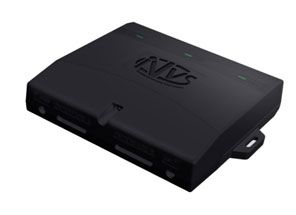

# NVS - Navitrek UM-04

The Navitrek UM-04 from NVS is a compact vehicle device designed to determine navigational parameters using GLONASS and GPS signals while supporting monitoring of vehicle condition and alarm event notifications. It is intended to provide continuous positional awareness and to exchange information with a dispatch center, making it suitable for vehicle oversight and basic telematics workflows.

Although the Navitrek UM-04 is built to work with the Navionis Automated Monitoring and Control System, its support for common transport monitoring software makes it a practical option for third party platforms such as Plaspy. When paired with Plaspy, the UM-04 can contribute location data, event notifications, and condition indicators into a centralized fleet management view for operational visibility.

## Key Highlights

- Uses GLONASS and GPS signals to determine navigational parameters for vehicles
- Supports monitoring of vehicle condition to aid operational oversight
- Provides alarm event notification to alert dispatch or operations teams
- Enables information exchange with a dispatch center for coordinated response
- Designed for integration with Navionis while remaining compatible with other monitoring systems
- Practical for fleet operators seeking a straightforward tracking device for location and event visibility

## How It Works with Plaspy

As a Plaspy compatible device, the Navitrek UM-04 can deliver position and event information into Plaspy so teams can monitor vehicles, respond to alarms, and analyze movements from one platform. Integration brings device-sourced navigation parameters and status reports into Plaspy dashboards and reporting tools.

- Real time location display and historical route playback for operational review
- Alarm and event notifications mapped into Plaspy alerting and notification workflows
- Vehicle condition indicators surfaced in Plaspy for status monitoring and follow up
- Dispatch center messages and information exchange reflected in Plaspy activity logs
- Aggregated reporting and fleet level views to support operational planning and oversight

## Typical Use Cases

- Fleet location tracking for small and medium vehicle operations
- Remote monitoring of vehicle condition and status for dispatch decisions
- Security and alarm notification integration for rapid response
- Consolidation of Navitrek UM-04 data into a centralized fleet management platform
- Supplementing an existing Navionis deployment with alternative monitoring software

## Why Choose This Tracker with Plaspy

The Navitrek UM-04 is a practical choice for organizations that need reliable satellite based position data along with basic vehicle condition monitoring and alarm notifications. Its documented compatibility with transport monitoring systems makes it a sensible candidate for integration into Plaspy where that device data can be combined with other fleet information.

For operators who want a device focused on navigation parameters and event exchange rather than extensive ancillary features, the UM-04 offers a straightforward profile. Using Plaspy to collect and present UM-04 data gives teams centralized visibility, consistent alerting, and reporting that supports day to day fleet management.

If you would like to learn more about how Navitrek UM-04 data can appear in Plaspy visit https://www.plaspy.com to explore platform capabilities. Product specifications availability and manufacturer details can change over time so please verify current technical information on the official manufacturer site https://www.nvs-ts.ru/
