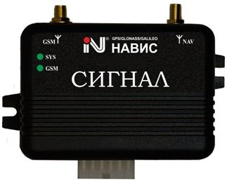

# NVS - SIGNAL S-2115

The SIGNAL S-2115 from NVS is a mobile equipment kit designed for automotive wireless alarm and monitoring. It uses GNSS satellite signals including GLONASS, GPS, GALILEO and SBAS, and is built around the certified NV08C receiver by ZAO KB NAVIS. The kit is intended for installation in land vehicles and is supplied as a package that includes transport monitoring software for basic tracking and dispatch needs.

As a Plaspy compatible device, the SIGNAL S-2115 can integrate with fleet management platforms that accept open information exchange protocols. Its open protocol design and certified GNSS receiver make it a practical option for organizations that want to add a proven tracking device into Plaspy for live location visibility, dispatch support, and centralized monitoring without proprietary lock in.

## Key Highlights

- Mobile equipment set for automotive wireless alarm and monitoring suitable for land vehicles
- Supports GNSS signals including GLONASS, GPS, GALILEO and SBAS for global satellite positioning
- Uses the certified NV08C receiver manufactured by ZAO KB NAVIS
- Open protocol of information exchange for integration with external navigation and monitoring systems
- Includes free transport monitoring software as part of the package
- Awarded GLONASS GNSS Forum Test Certificate No 06I-2011 indicating tested GNSS performance

## How It Works with Plaspy

The SIGNAL S-2115 can feed positional and monitoring information into Plaspy through its open information exchange protocol, enabling fleet operators to consolidate vehicle data and supervision within Plaspy. Integration focuses on bringing the tracker data into Plaspy dashboards and workflows for operational use.

- Provides live location visibility of vehicles inside Plaspy for route monitoring and dispatch oversight
- Enables consolidated fleet tracking and status view alongside other Plaspy compatible devices
- Supports alerting and event reporting workflows within Plaspy for alarm and monitoring signals
- Supplies recorded position data that Plaspy can use for historical reports and trip analysis
- Helps centralize operational monitoring so dispatchers can make informed decisions from a single platform

## Typical Use Cases

- Fleet dispatch and real time vehicle location visibility for logistics and field services
- Vehicle security and alarm monitoring where automotive alarm signals need central management
- Route verification and post trip reporting using recorded GNSS position data
- Integration into existing navigation and dispatch systems that require an open protocol device
- Small to medium fleet operations that can use the included monitoring software alongside Plaspy

## Why Choose This Tracker with Plaspy

The SIGNAL S-2115 is a practical choice for organizations that need a tested GNSS tracking kit with an open protocol for integration. Its certification and NV08C receiver indicate a level of GNSS reliability, while the included monitoring software provides an immediate out of the box option. When paired with Plaspy, this tracker can contribute to a consolidated fleet monitoring strategy without forcing a fully proprietary setup.

If you want to learn more about Plaspy and how it can work with compatible devices like the SIGNAL S-2115 visit https://www.plaspy.com. Product specifications, availability and manufacturer details can change over time so please verify current technical information on the official NVS site https://www.nvs-ts.ru/.
