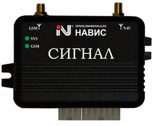

# NVS - SIGNAL S-2117

The SIGNAL S-2117 by NVS is a mobile equipment kit designed for vehicle security and positioning. It operates across GLONASS, GPS, GALILEO, and SBAS satellites and includes the NV08C certified receiver from ZAO KB NAVIS, providing a foundation for reliable positioning. Packaged as an automotive wireless alarm and monitoring system, the kit is recommended for monitoring and dispatching systems of land vehicles and is shipped with free transport monitoring software.

As a device with an open information exchange protocol, the SIGNAL S-2117 is well suited for integration with third party platforms such as Plaspy. Its multi GNSS capability and certification make it a practical option for organizations that want to bring vehicle position, alarm status, and tracking data into Plaspy for centralized fleet oversight, historical reporting, and operational monitoring.

## Key Highlights

- Supports multiple GNSS constellations including GLONASS, GPS, GALILEO, and SBAS for broad satellite coverage
- NV08C certified receiver for consistent positioning performance
- Designed as an automotive wireless alarm and monitoring solution for land vehicles
- Open protocol of information exchange for easier integration into existing systems
- Recommended for vehicle monitoring and dispatch applications with a GNSS Forum test certificate
- Includes free transport monitoring software as part of the package

## How It Works with Plaspy

The SIGNAL S-2117 can feed position and alarm information into Plaspy using its open data exchange approach, allowing fleet managers to view device activity alongside other assets. Plaspy can consolidate the tracker data into maps, reports, and alerts so teams can maintain operational awareness and review historical movements.

- Real time location visualization on Plaspy maps for individual vehicles and groups
- Alerting and alarm handling within Plaspy based on the device events exposed by the tracker
- Historical route playback and trip reports to support operational review and compliance
- Fleet level dashboards and reporting to track utilization and activity over time
- Integration of device status into dispatch workflows for timely responses and coordination

## Typical Use Cases

- Fleet monitoring and dispatch for commercial land vehicles
- Vehicle security and alarm monitoring for cars and light trucks
- Transport and logistics tracking for route oversight and reporting
- Rental fleet oversight and asset management for dispersed vehicles
- Integration into existing navigation and information systems for centralized monitoring

## Why Choose This Tracker with Plaspy

The SIGNAL S-2117 is a practical option for organizations seeking a GNSS capable tracker that can be integrated into a broader fleet management platform. Its multi constellation reception and NV08C certified receiver provide a sensible baseline for positioning, while the device's open protocol helps reduce integration friction when connecting to Plaspy.

Using the SIGNAL S-2117 with Plaspy allows teams to combine the device's positioning and alarm data with Plaspy's fleet visibility, reporting, and operational tools. For businesses evaluating trackers for land vehicle monitoring, this model offers a balanced combination of manufacturer supplied software and the flexibility to operate within a third party platform like Plaspy.

To learn more about integrating SIGNAL S-2117 with Plaspy visit https://www.plaspy.com. Product specifications, availability, and manufacturer details can change over time, so please verify current specifications and documentation on the official manufacturer site https://www.nvs-ts.ru/.
