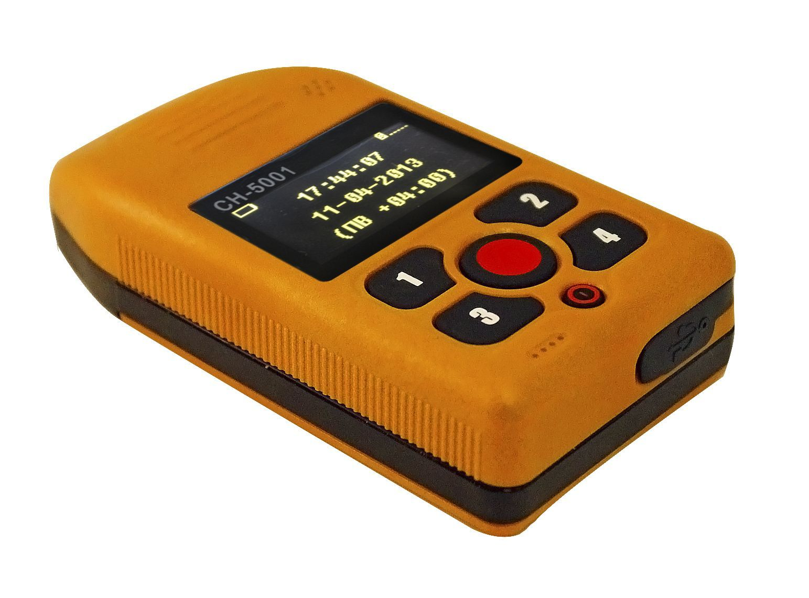

# NVS - SN-5001

The NVS SN-5001 is a compact navigation device that leverages GLONASS and GPS satellite systems to determine and report location. Designed for reliable position reporting, the unit can transmit location data to a monitoring center for real time tracking and monitoring. It also supports incoming and outgoing calls to programmed numbers and can send an alarm signal to a monitoring center in case of an emergency, with a range of configurable settings to adapt to different operational needs.

As a Plaspy compatible device, the SN-5001 can feed its location and event information into the Plaspy platform to support centralized monitoring and fleet oversight. Plaspy can use the device's location updates and alarm signals to improve visibility, trigger alerts, and include the unit in reporting and operational dashboards, making the SN-5001 a practical option for organizations that want straightforward telemetry and emergency notification integrated into Plaspy.

## Key Highlights

- Dual GNSS reception using GLONASS and GPS for improved positioning reliability in mixed satellite environments.
- Compact form factor suitable for a variety of mobile and fixed monitoring scenarios.
- Real time location reporting to a monitoring center for continuous visibility.
- Ability to place and receive calls to programmed numbers for basic voice communication and confirmation.
- Emergency alarm signaling to notify a monitoring center when assistance is required.
- Configurable settings to tailor behavior for different operational needs.

## How It Works with Plaspy

The SN-5001 can be connected to Plaspy to provide continuous location updates and event notifications for centralized fleet and asset management. Once the device is configured to transmit its data, Plaspy can ingest location and alarm information to present it alongside other fleet data.

- Live location updates appear on Plaspy maps for real time vehicle and asset visibility.
- Alarm signals from the device can be routed into Plaspy alerting workflows to notify operators and trigger response procedures.
- Call and event occurrences can be logged in Plaspy as part of an asset timeline for operational review.
- Historical location data can be used in Plaspy reporting and playback to analyze routes and incidents.
- Devices can be grouped in Plaspy for role based monitoring and operational dashboards.

## Typical Use Cases

- Vehicle fleet tracking for businesses that need reliable position reporting and monitoring.
- Asset monitoring where compact devices provide discreet location visibility.
- Personnel safety and lone worker monitoring using alarm and call features for emergency notification.
- Delivery and logistics operations that require ongoing location updates and incident reporting.
- Rental equipment tracking when periodic reporting and emergency alerts are valuable.

## Why Choose This Tracker with Plaspy

The SN-5001 pairs a simple, compact navigation design with essential communication and alarm features, making it a practical choice for organizations that require dependable location reporting and basic emergency signaling. Its dual GNSS capability supports improved positional reliability, and the call and alarm functions add an operational layer that can be helpful for safety focused deployments.

When used with Plaspy, the SN-5001 becomes part of a centralized monitoring workflow that supports visibility, alerting, and reporting across fleets and assets. For teams seeking straightforward integration of location and emergency events into their management platform, the SN-5001 offers a balance of size, functionality, and configurability that complements Plaspy without unnecessary complexity.

Learn more about Plaspy and how compatible devices are used to improve fleet and asset oversight at https://www.plaspy.com. Product specifications, availability, and manufacturer details can change over time; for the most current technical information about the NVS SN-5001 please verify specifications on the manufacturer site https://www.nvs-ts.ru/
